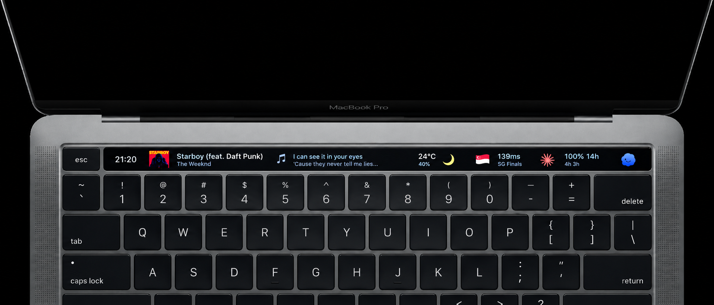

<!-- markdownlint-disable MD033 MD041 -->
<p align="center">
  
</p>

<h3 align="center">Agentic TouchBar</h3>
<p align="center">A customisable BetterTouchTool Touch Bar for music, weather, VPN, and AI agent quotas.</p>
<!-- markdownlint-enable MD033 MD041 -->

## Purposes

Agentic TouchBar puts the information and actions you reach for most into one
at-a-glance Mac control surface. It is built on BetterTouchTool (BTT), but the
behaviour lives in plain shell scripts, Python, and preset data, so you can
read it, test it, and ask an AI coding agent to customise it without building a
plugin or running a background service.

## Capabilities

| Capability | Entry point |
| --- | --- |
| Import a complete Touch Bar layout | `bttpreset/Default.bttpreset` |
| Check dependencies, permissions, and paths | `actions/doctor.sh` |
| Inspect the music and Lyrics pipeline | `widgets/now-playing-lyrics.sh --report` |
| Run the standard test suite | `tests/run.sh` |

The full widget list, refresh cadence, tap actions, and configuration knobs are
documented in [Widgets](#widgets) and [Configuration](#configuration).

## Compatibility

- Works with BetterTouchTool on macOS, with either a physical Touch Bar or the
  Control Strip. BTT needs Automation permission to drive itself.
- The core scripts use macOS `zsh`, `curl`, and Python 3.9+. Optional widgets
  can use `jq`, `nowplaying-cli`, `codexbar`, Apple Music, and a Clash/Mihomo
  controller, as described in [Get started](#get-started).
- No project build, plugin installation, or background service is required.
  An optional native MediaRemote helper improves the paused-state icon; the
  preset and the script widgets remain usable without it.
- The exported preset expects the checkout at `~/Documents/BTT`. A different
  location works after the one-line rewrite described in
  [Cloning somewhere else](#cloning-somewhere-else).

Released under the [PolyForm Noncommercial 1.0.0 license](LICENSE) — free for
personal and non-commercial use. Not affiliated with BetterTouchTool or
Folivora — see [THIRD-PARTY.md](THIRD-PARTY.md).

## Widgets

Import the preset and get a compact status strip for the things that matter
while you work, listen, or move between networks.

| Widget | What it gives you | Script or source | Refresh | Tap action |
| --- | --- | --- | --- | --- |
| Lyrics | Synchronised lyrics beside the current track | `widgets/now-playing-lyrics.sh` | 1 s | Repaint after a short delay |
| Now Playing | Title, artist, album, and a cover or player icon; browsers ignored | `widgets/now-playing.sh` | 1 s | Play or pause the active player, then refresh Lyrics |
| Codex | Codex quota at a glance | `widgets/codex-quota.sh` | 300 s | Refresh |
| Claude | Claude 5 h / 7 d quota | `widgets/claude-quota.sh` | 600 s | Refresh |
| OpenCode | OpenCode Go 5 h / 7 d quota | `widgets/opencode-quota.sh` | 300 s | Refresh |
| 🌐 | Selected Clash node's region | `widgets/clash-region.sh` | 300 s | Refresh region and latency |
| Latency | Selected Clash node's latency | `widgets/clash-latency.sh` | 300 s | Refresh region and latency |
| Star | Apple Music favourite state | Preset AppleScript + `actions/now-playing-app.sh` | 10 s | Toggle favourite |
| Weather | Temperature and humidity | `widgets/weather.sh --text` | 600 s | Refresh both weather widgets |
| Weather Icon | Current conditions icon | `widgets/weather.sh --icon` | 600 s | Refresh both weather widgets |

The Star widget is configured natively in the preset. The other rows are
backed by repository scripts, so their behaviour is visible and editable.

## Get started

The standard setup is an import-and-run workflow. There is no project
compilation step and no plugin to install.

Clone to `~/Documents/BTT` so the exported preset can find every script:

```sh
git clone https://github.com/zhenyulin/BTT.git ~/Documents/BTT
cd ~/Documents/BTT
```

Then:

1. **Install the core command-line tools.** `zsh`, `curl`, and Python 3.9+
   ship with macOS. Install the two required Homebrew tools:

   ```sh
   brew install jq nowplaying-cli
   ```

   For the Codex, Claude, and OpenCode quota rows, also install:

   ```sh
   brew install codexbar
   ```

   The quota rows are the only part that needs `codexbar`; the rest of the bar
   works without it. Apple Music powers the Lyrics and Star widgets, and a
   running Clash/Mihomo controller powers the network widgets.

2. **Back up your current BTT setup**, then import
   `bttpreset/Default.bttpreset` in BetterTouchTool. The preset is named
   `Default` and includes general BTT settings, so export anything you may
   want to restore first.

3. **Run the preflight.** It checks the toolchain, helper, BTT permissions,
   repository layout, and optional integrations, then prints the fix beside
   anything missing:

   ```sh
   actions/doctor.sh
   ```

4. **Connect the preset's taps.** This sets the BTT persistent variables used
   by widget taps and track changes:

   ```sh
   actions/set-widget-variables.sh
   ```

5. **Tap through the bar.** A widget greys out during a refresh, then returns
   with its new value. `actions/doctor.sh` and the Lyrics report are useful
   first checks if anything stays quiet:

   ```sh
   widgets/now-playing-lyrics.sh --report
   ```

### Optional paused-state polish

The preset does not need a compiled component. If you want the Now Playing
icon to switch precisely between cover art and the play icon while paused,
build the small MediaRemote helper from the included source:

```sh
clang -O2 actions/nowplaying-state.m -framework Foundation \
    -F/System/Library/PrivateFrameworks -framework MediaRemote \
    -o ~/Library/Application\ Support/BTT/nowplaying-state
```

Without it, the Now Playing row still works, but paused playback may retain
the album cover instead of showing the play icon. This is the only compiled
piece in the repository, and it is an enhancement rather than a prerequisite
for importing the preset.

### Configure weather (optional)

The weather widgets work with no key. To add QWeather as a fast fallback that
can still answer when the VPN node has timed out, copy the template and add a
free key from [console.qweather.com](https://console.qweather.com):

```sh
cp .env-template .env
```

### Cloning somewhere else

Every script honours `BTT_REPO_DIR`, so the scripts work from any checkout.
The preset is the exception: its script paths point to
`$HOME/Documents/BTT`. Either clone there, or rewrite the preset before
importing it:

```sh
sed -i '' "s|\$HOME/Documents/BTT|$PWD|g" bttpreset/Default.bttpreset
```

`actions/doctor.sh` reports a warning when the checkout is somewhere the
preset will not find.

## Make it yours

Agentic TouchBar is meant to be customised. The preset gives you a useful
starting point; the repository keeps the behaviour close enough to the surface
that an AI coding agent can help you change it safely.

| Change | Start here |
| --- | --- |
| Add or tune a widget | `widgets/` |
| Change a tap, gesture, or setup action | `actions/` |
| Change the Touch Bar layout or native BTT actions | `bttpreset/Default.bttpreset` |
| Understand the behaviour contract | `specs/FEATURES.md` and `specs/design/` |
| Run the Lyrics tests | `tests/run.sh` |

Runtime state and diagnostics are created automatically in `cache/` and
`logs/`. There is no daemon to keep alive and no generated build directory to
manage.

## Music that stays out of the way

The Now Playing row uses an allowlist in `BTT_NOW_PLAYING_ALLOWED`, so a
browser playing YouTube cannot take over the bar. It shows the title, artist,
album, and the best available cover or player icon, then hides itself when no
allowed player owns the Now Playing session. The tap addresses the player the
row is showing, rather than blindly sending a media key to whichever app last
claimed the system session.

The native BTT Now Playing widget cannot ignore individual apps, so the script
widget replaces it in the preset. A long press toggles the `Music` Touch Bar
group. A long press on Lyrics opens the current player.

The tap runs `actions/now-playing-toggle.sh` rather than BTT's own `Play or
Pause` action. The script resolves the player the same way as the row:
Apple Music is addressed through AppleScript, while other allowed players use
the media key through BTT. This keeps a browser that happens to own the system
session from receiving the tap meant for the music row.

The group toggle is a named trigger (`Toggle Music Group`) running AppleScript.
It asks `get_active_touch_bar_group` and triggers either `Open Touch Bar Group
With Name` (205) or `Close currently open Touch Bar group` (191). Now Playing
is merged into groups, so the same long press can close the group from inside
it.

The track comes from the cheapest MediaRemote source that can answer in full.
The helper is tried first because it takes about 0.05 s compared with about
0.22 s for `nowplaying-cli` `get-raw`; the CLI fills in the holder or artwork
when the helper cannot answer alone. The shared dictionary is written to
`cache/now-playing.raw.json`, so the Lyrics sampler and Star widget can reuse
it instead of querying MediaRemote again. The implementation is documented in
[`widgets/lib/media-remote.sh`](widgets/lib/media-remote.sh).

Media-key next/previous and the two-finger swipe triggers run
`actions/track-changed.sh`. It pre-warms the lyrics in a detached process,
then refreshes Lyrics and Star. When the player closes, the three music
widgets leave together instead of leaving a favourite button behind.

Every widget script accepts its BTT widget UUID as an optional first argument.
Without one, it prints ordinary terminal text, which makes the same behaviour
easy to inspect and test outside BTT.

## Weather that follows you

Weather asks BTT for the Mac's current location, so there is no coordinate to
configure and nothing to update when you move. QWeather (和风天气) is asked
first through a DIRECT route, followed by Open-Meteo and BTT's `get_weather`
(Apple WeatherKit). QWeather needs a free key and host; the other two do not.

Tapping either weather widget starts one shared detached refresh, so both
values update together. The tapped row dims while the refresh runs and returns
with the cached `weather.data` value. The former Apple Weather Shortcut bridge
is parked because a failed run raises a Shortcuts alert on every refresh.
QWeather offers 50k requests per month on its free plan; provider facts live in
[`specs/reference/PROVIDERS.md`](specs/reference/PROVIDERS.md).

## Agent quotas at a glance

The Codex, Claude, and OpenCode rows turn quota data into an at-a-glance status
signal. They remain independent from the music and weather rows, so a missing
quota provider does not take down the rest of the bar. Tap a quota row to force
an immediate refresh instead of waiting for its normal interval.

## Actions

| Script | Purpose |
| --- | --- |
| `actions/doctor.sh` | First-run preflight: dependencies, the compiled helper, BTT permissions, repository layout |
| `actions/tap-refresh.sh` | Force one or more widgets to refresh now, even with a fresh cache |
| `actions/track-changed.sh` | Track-change hook: detached lyrics pre-warm plus widget refresh |
| `actions/now-playing-app.sh` | Print the current Now Playing holder's bundle id; gates the Star widget |
| `actions/now-playing-toggle.sh` | Now Playing tap: play or pause the player the row is showing |
| `actions/set-widget-variables.sh` | Set the BTT persistent variables mapping widget names to UUIDs |
| `actions/tap-restart.sh` | Date/Time widget tap: mark the traces before BTT's own restart action |
| `actions/btt-quit.sh` | Quit BTT for real, including when BTTRelaunch would bring it back |

## Configuration

Scripts read environment variables with built-in defaults. Set them where BTT's
shell actions can see them: BTT environment variables, `~/.zshenv`, or, for
weather widgets only, `$BTT_REPO_DIR/.env`.

| Variable | Default | Used by |
| --- | --- | --- |
| `BTT_REPO_DIR` | `~/Documents/BTT` | Every script: repository, cache, and log paths |
| `BTT_LOG_DIR` | `$BTT_REPO_DIR/logs` | Logging |
| `CLASH_API`, `CLASH_SECRET`, `CLASH_SOCKET`, `CLASH_GROUP` | `http://127.0.0.1:9097`, `""`, `/tmp/verge/verge-mihomo.sock`, `PROXY` | Clash widgets (`widgets/lib/clash.sh`) |
| `CLASH_ICON`, `CLASH_FONT_COLOR` | — | Icon and colour for the Clash widgets |
| `CLASH_LATENCY_MIN_MS`, `CLASH_LATENCY_MAX_MS` | `150`, `500` | Latency colour bands |
| `CLAUDE_QUOTA_MAX_AGE`, `CODEX_QUOTA_MAX_AGE`, `OPENCODE_QUOTA_MAX_AGE` | `300` | Quota cache freshness, in seconds |
| `BTT_LYRICS_*` | — | Lyrics tunables; see [`specs/design/LYRICS.md`](specs/design/LYRICS.md) |
| `BTT_NOW_PLAYING_ALLOWED` | `com.apple.Music com.tencent.QQMusicMac` | Space-separated bundle ids allowed to hold the Now Playing row and drive the Lyrics sampler's MediaRemote fallback |
| `BTT_NOW_PLAYING_STATE_BIN`, `BTT_NOW_PLAYING_CLI` | The helper in BTT's support directory, `nowplaying-cli` on `PATH` | The two MediaRemote sources (`widgets/lib/media-remote.sh`) |
| `BTT_NOW_PLAYING_RAW_PATH`, `BTT_NOW_PLAYING_RAW_MAX_AGE` | `$BTT_REPO_DIR/cache/now-playing.raw.json`, `5` | The raw Now Playing dictionary and its maximum age for Lyrics and Star |
| `BTT_WEATHER_QW_HOST`, `BTT_WEATHER_QW_KEY` | — | Weather widgets: QWeather API host and key; unset either to skip QWeather |
| `BTT_WEATHER_UNIT`, `BTT_WEATHER_TTL` | `celsius`, `300` | Weather widgets: unit and cache TTL, in seconds |

### Where the weather is

The weather widgets ask BTT for the Mac's location instead of reading a
coordinate pair from the environment. QWeather, Open-Meteo, and BTT's own
WeatherKit lookup all use that point, and `widgets/weather.sh --location`
prints it. Without Location Services for BetterTouchTool, those sources stay
off and the row keeps its last reading.

## Lyrics, deeply integrated

The Lyrics widget samples Apple Music and MediaRemote, searches local LRC
files, Apple Music's cached TTML, LrcAPI, and LRCLIB, then renders the result
within the available width. Its behaviour contract and configuration live in
[`specs/design/LYRICS.md`](specs/design/LYRICS.md).

Diagnostics:

```sh
widgets/now-playing-lyrics.sh --report      # render and trace health
widgets/now-playing-lyrics.sh --watch       # live tick stream
widgets/now-playing-lyrics.sh --diagnose    # full diagnosis
```

## Quitting BTT

When BTT is wedged, quitting from its own menu may not stick: the quit Apple
Event is not processed and BTTRelaunch brings the process back. Use
`actions/btt-quit.sh` to quit for real. It stops BTTRelaunch, asks BTT to quit,
and escalates to TERM/KILL if needed. The preset wires the Date Time widget to
this flow: tap restarts BTT, while a long press quits it for real.

## Documentation

- [`specs/FEATURES.md`](specs/FEATURES.md) — observable widget behaviour and
  the design index.
- [`specs/design/`](specs/design/) — feature documents for Now Playing, Lyrics,
  Star, the shared widget runtime, quotas, Clash, weather, and BTT control.
- [`specs/CONSTRAINTS.md`](specs/CONSTRAINTS.md) — layout and stacking limits.
- [`specs/NOTE.md`](specs/NOTE.md) — promoted repository learnings and preset
  rules.

## Troubleshooting

Start with `actions/doctor.sh`. It covers most of the list below and prints the
fix beside each failure.

| Symptom | Cause and fix |
| --- | --- |
| Every widget is blank or never appears | BTT lacks Automation permission to script itself. Re-enable it under System Settings → Privacy & Security → **Automation** → BetterTouchTool. macOS only prompts once, so the checkbox may need ticking by hand. |
| A widget shows a short label instead of a value | That label is the failure: `NO CODEXBAR`, `No curl`, `Controller`, `--`, or `🌐`. Install what it names, or leave it; a missing dependency never breaks the other widgets. |
| Now Playing shows the album cover while paused | The MediaRemote helper is not built. Run the optional `clang` command in [Get started](#get-started); without it the playback rate can leave the cover where the play icon belongs. |
| Weather shows the wrong city | The row follows the Mac, so BTT reported a wrong or stale location. Check `widgets/weather.sh --location`, then BTT's location under System Settings → Privacy & Security → Location Services. |
| Tapping a widget does nothing | The BTT persistent variables are unset, so the tap cannot address the widget. Re-run `actions/set-widget-variables.sh`, especially after importing a preset edited by hand. |
| The Lyrics widget is empty but music is playing | The player may not be allowed to hold the row; add its bundle id to `BTT_NOW_PLAYING_ALLOWED`. Browsers are excluded on purpose. Then check `widgets/now-playing-lyrics.sh --report`. |
| A widget stays grey | Grey means a refresh is in flight; it clears when the refresh ends. If it never clears, the refresh process died holding the lock; delete `cache/<widget-name>.refreshing` and `cache/<widget-uuid>.force`. |
| Quitting BTT does not stick | Known BTT behaviour when it is wedged. Use `actions/btt-quit.sh`, which stops BTTRelaunch first. |
| Nothing works after moving the checkout | The preset points to `$HOME/Documents/BTT`. See [Cloning somewhere else](#cloning-somewhere-else). |

## Testing

The Lyrics package carries a dependency-free test suite using stdlib
`unittest`. This mirrors the Python available to BTT:

```sh
tests/run.sh                    # everything
tests/run.sh lyrics.test_lrc    # one module
```

Every path the package reads is redirected into a temporary directory before
Python starts, so tests never touch your `cache/` or `logs/`.

## Uninstall

1. In BTT, delete the imported preset, or restore the preset you exported
   before importing it.
2. `rm -rf ~/Documents/BTT` removes the checkout. Runtime state stays inside
   it; only the optional native helper lives at
   `~/Library/Application Support/BTT/nowplaying-state`.
3. Optionally remove the native helper.
4. Remove the Homebrew packages you installed for this project:
   `brew uninstall nowplaying-cli jq codexbar`.

## Contributing

Issues and pull requests are welcome. Before opening a PR:

- Run `tests/run.sh`; it must stay green.
- Run `actions/doctor.sh` if you touched anything BTT-facing.
- Keep widget behaviour consistent with [`specs/FEATURES.md`](specs/FEATURES.md).
  If intended behaviour changes, update the spec in the same PR.
- Match the surrounding style: shell in `zsh` with `set -u`, comments that
  explain why rather than what, and no new dependencies where a shell builtin
  or the standard library will do.

## License

[PolyForm Noncommercial 1.0.0](LICENSE) permits personal, hobby, study, and
other non-commercial use, including use by non-commercial organisations.
Commercial use, including resale or paid redistribution of the widgets or the
preset, is not permitted, and copyright remains with the author.

Third-party trademarks, services, and dependencies are covered separately in
[`THIRD-PARTY.md`](THIRD-PARTY.md).

## Acknowledgements

The Lyrics widget would be much poorer without the community APIs it falls
back to — [LRCLIB](https://lrclib.net) and
[LrcAPI](https://github.com/AprilForApril/LrcApi) — and without
[`nowplaying-cli`](https://github.com/kirtan-shah/nowplaying-cli), which is the
only tool here that exposes the Now Playing session holder's bundle id and
album artwork.
