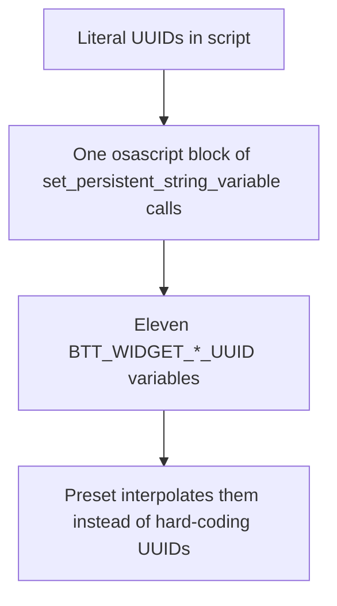
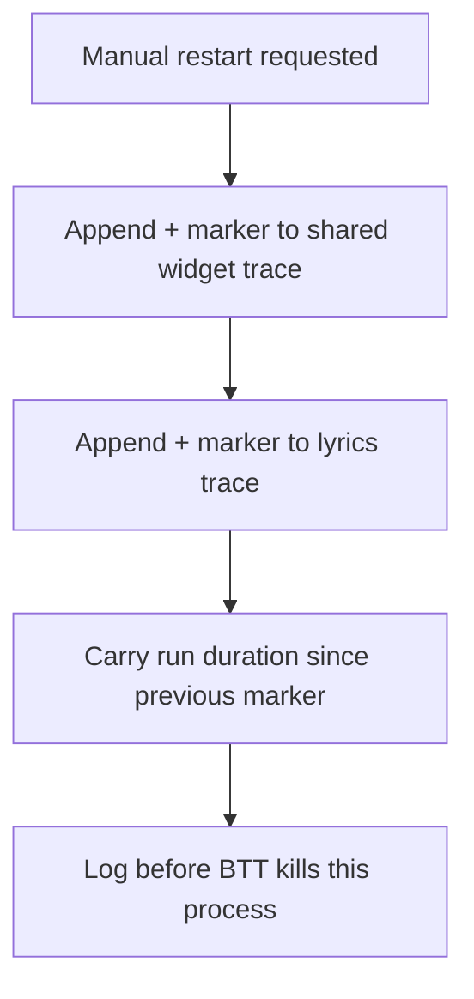
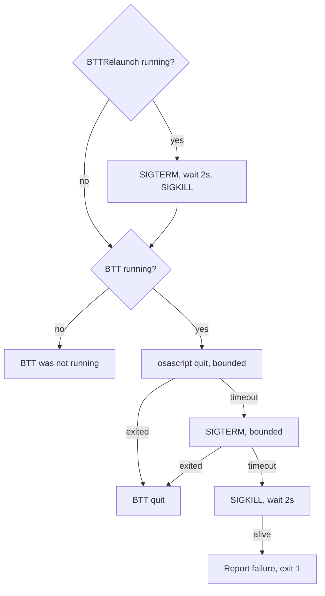
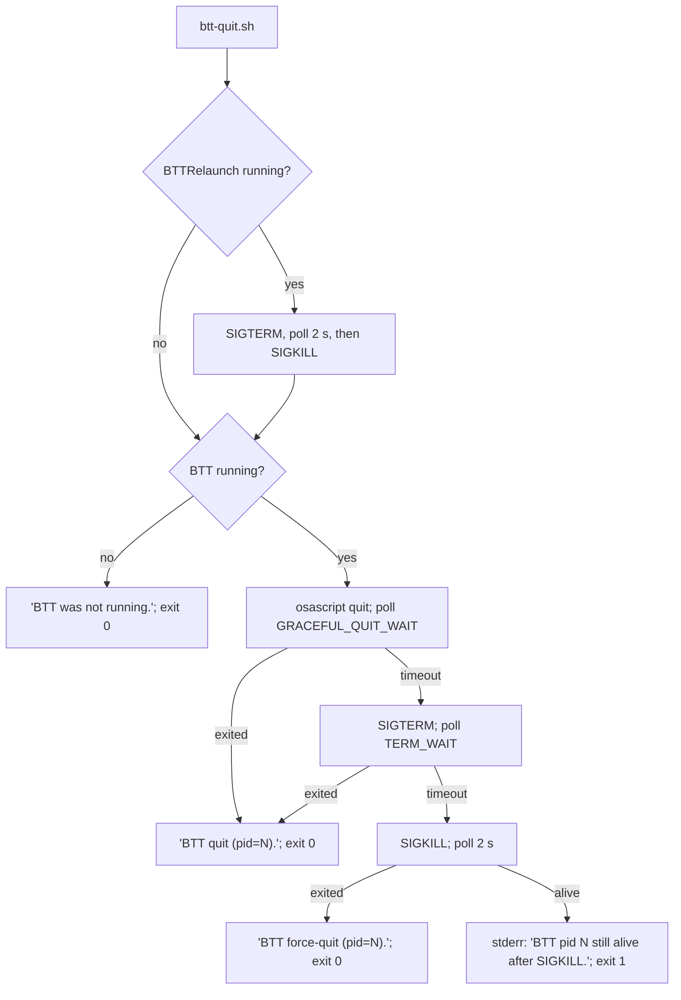

# BTT Control Specification

Indexed from [`specs/FEATURES.md`](../FEATURES.md). The failure modes these
actions exist for are in [`specs/CONSTRAINTS.md`](../CONSTRAINTS.md).

## Reconstruction Target

This document preserves the three operator actions that manage
BetterTouchTool itself rather than a widget: naming every widget's UUID so the
preset can address it, restarting BTT while leaving a mark in the traces, and
quitting BTT in a way that sticks.

## Entry Points

| Entry point | Trigger | Contract |
| --- | --- | --- |
| `actions/set-widget-variables.sh` | Operator, once per install | Sets eleven BTT persistent string variables mapping widget names to UUIDs. |
| `actions/tap-restart.sh` | Tap on the Date/Time widget, `BTTOrder` 5 | Marks the traces, then BTT's own `Restart BetterTouchTool` action (`BTTOrder` 7) does the restart. |
| `actions/btt-quit.sh` | Long press on the Date/Time widget → `Quit BTT` named trigger | Quits BTT for real, escalating as far as `SIGKILL`. |

| Variable | Default | Meaning |
| --- | --- | --- |
| `BTT_QUIT_GRACEFUL_WAIT` | `5` | Seconds allowed for the quit Apple Event before `SIGTERM`. |
| `BTT_QUIT_TERM_WAIT` | `3` | Seconds after `SIGTERM` before `SIGKILL`. |
| `BTT_LOG_DIR` | `$BTT_REPO_DIR/logs` | `btt-control.log` and both trace files. |

Both wait values are validated: anything that is not a positive number falls
back to its default.

## Feature Tree

### Address widgets by name



### [Restart, recorded](#restart-markers)



### [Quit for real](#quitting)



## Decision Trees

### Quitting



BTTRelaunch dies first because it is the only thing that can resurrect BTT
after death: BTT's own quit works only while its main thread is healthy, a
wedged main thread cannot process the quit Apple Event, and force-quitting a
wedged BTT just lets BTTRelaunch bring it back. The next launch of BTT
re-creates BTTRelaunch, so this is not a permanent change.

Every wait is bounded, so a wedged BTT costs a few seconds rather than a stuck
terminal. Each step is logged to `logs/btt-control.log`.

### Restart Markers

`tap-restart.sh` appends one row to each trace before BTT restarts:

```text
+ 1743.221 BTT manual restart
```

Column two is the span, in seconds, between the oldest and newest timestamped
rows since the previous `+`. A restart otherwise silently inflates the next
run-duration measurement, because the trace would read as one uninterrupted
session.

Everything is written before BTT's restart action runs: BTT may kill this
process the moment it does.

The trace markers stay because they are read by the widget traces
themselves.

## Journey Contracts

### Widget Variables

**Input:** none; the UUIDs are literals in the script.

**Transformation:** one `osascript` block of
`set_persistent_string_variable "<name>" to "<uuid>"` calls.

**Output:** eleven BTT variables — `BTT_WIDGET_CLASH_LATENCY_UUID`,
`BTT_WIDGET_CLASH_REGION_UUID`, `BTT_WIDGET_CLAUDE_UUID`,
`BTT_WIDGET_CODEX_UUID`, `BTT_WIDGET_DATE_TIME_UUID`,
`BTT_WIDGET_LYRICS_UUID`, `BTT_WIDGET_NOW_PLAYING_UUID`,
`BTT_WIDGET_OPENCODE_UUID`, `BTT_WIDGET_STAR_UUID`,
`BTT_WIDGET_WEATHER_ICON_UUID`, `BTT_WIDGET_WEATHER_UUID`.

**Why:** the preset's shell and AppleScript actions interpolate
`{BTT_WIDGET_*_UUID}` rather than hard-coding UUIDs, so taps, track-change
refreshes, and the widget scripts themselves all address widgets through one
mapping. Without this step those placeholders expand to nothing and every tap
refresh silently does nothing.

**Properties:** idempotent, and safe to re-run after a preset re-import — but
it is the *script* that must be updated when a UUID changes, since the
literals live here rather than being read back from the preset.

### Restart

**Input:** a tap on the Date/Time widget.

**Outputs:** `+` rows in `logs/trace.tsv` and `logs/lyrics/trace.tsv`, and one
line in `logs/btt-control.log` recording the request and BTT's pid.

**Properties:** best-effort throughout — every write is guarded, because a
failure to record must not prevent the restart that follows.

### Quit

**Input:** a long press on the Date/Time widget.

**Outputs:** stdout messages as in the flow above, log lines for each
escalation step, and exit status 0 on success, 1 when BTT survives `SIGKILL`.

**Properties:** safe to repeat; a run against a dead BTT prints `BTT was not
running.` and exits 0.

## Implementation Map

| Contract | Stable owner |
| --- | --- |
| Widget UUID variables | [`actions/set-widget-variables.sh`](../../actions/set-widget-variables.sh) |
| Restart markers | [`actions/tap-restart.sh`](../../actions/tap-restart.sh) |
| Quit escalation | [`actions/btt-quit.sh`](../../actions/btt-quit.sh) |
| Date/Time widget wiring, `Quit BTT` named trigger | [`bttpreset/Default.bttpreset`](../../bttpreset/Default.bttpreset) |
| Shared operator log | `logs/btt-control.log` |

## Verification Map

No automated tests; every check restarts or quits BTT.

| Behaviour to verify | Focused evidence |
| --- | --- |
| Variables | Run the script, then `osascript -e 'tell application "BetterTouchTool" to get_string_variable "BTT_WIDGET_LYRICS_UUID"'`. |
| Marker shape | Tap Date/Time and confirm both traces gained a `+` row whose second field is a plausible span. |
| Marker ordering | Confirm the marker precedes the restart gap in the trace, not follows it. |
| Graceful quit | Run `btt-quit.sh` against a healthy BTT and confirm it exits 0 well inside the graceful window, with no `SIGTERM` line in the log. |
| Escalation | Suspend BTT (`kill -STOP`) and confirm the run escalates through `SIGTERM` to `SIGKILL` with a log line each. |
| Relauncher | Confirm `BTTRelaunch` is gone after the quit, and back after the next BTT launch. |
| Idempotence | Run `btt-quit.sh` twice; the second prints `BTT was not running.` and exits 0. |

## Known Gaps

- Widget UUIDs are duplicated between `set-widget-variables.sh` and the
  preset; nothing checks that they still agree.
- The quit path assumes `BTTRelaunch` is the only resurrector; a
  `launchd`-managed BTT would defeat it.
