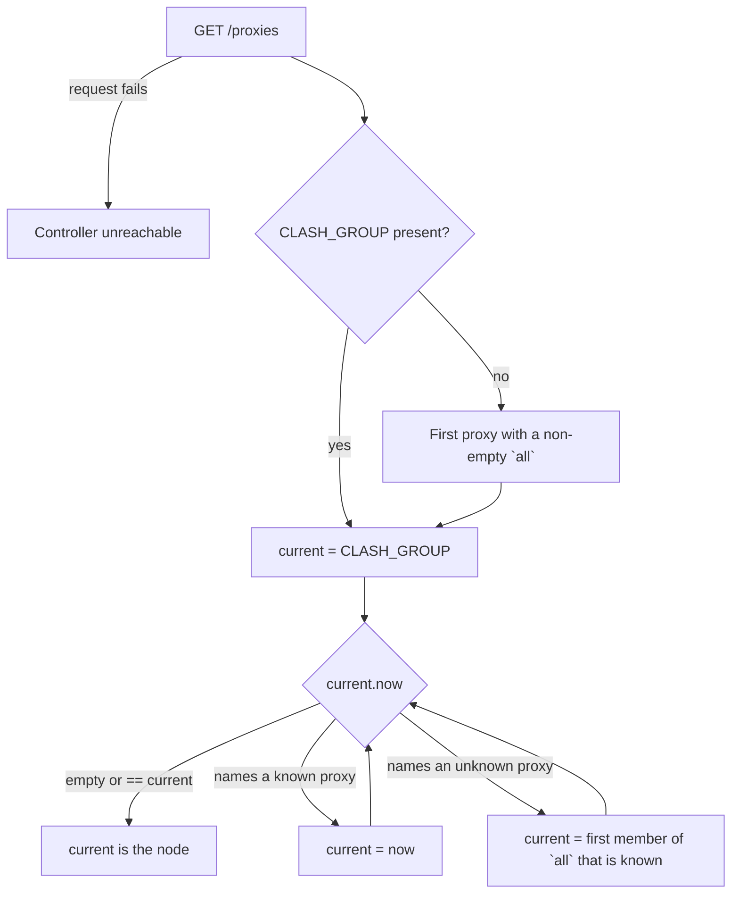

# Clash Widgets Specification

Indexed from [`specs/FEATURES.md`](../FEATURES.md). Lifecycle, caching,
colour interpolation, and tracing belong to
[`specs/design/WIDGET-RUNTIME.md`](WIDGET-RUNTIME.md).

## Reconstruction Target

This document preserves what the two Clash widgets show: how the currently
selected node is resolved out of a chain of proxy groups, how its region
becomes one flag glyph, how its latency is measured and coloured, and what
each widget shows when the controller cannot be reached.

Clash/Mihomo's controller API beyond the three endpoints used below is an
external boundary.

## Entry Points

| Entry point | Trigger | Contract |
| --- | --- | --- |
| `widgets/clash-region.sh <uuid>` | BTT widget, 300 s interval | One glyph: the selected node's regional flag, or `🌐`. |
| `widgets/clash-latency.sh <uuid>` | BTT widget, 300 s interval | Two rows: `<n>ms` over the node's label, or a one-word failure. |
| `<widget>.sh --refresh <uuid>` | The detached refresh | Queries the controller and stores the value. |
| Tap on either widget → `actions/tap-refresh.sh <region-uuid> <latency-uuid>` | User | Both widgets refresh together — they describe the same node. |
| After Mac wakes from sleep | BTT trigger 606 | Refreshes latency along with the three quota widgets. |

| Variable | Default | Meaning |
| --- | --- | --- |
| `CLASH_API` | `http://127.0.0.1:9097` | Controller base URL. |
| `CLASH_SOCKET` | `/tmp/verge/verge-mihomo.sock` | Used as `--unix-socket` when the path is a socket; ignored otherwise. |
| `CLASH_SECRET` | — | Sent as `Authorization: Bearer` when set. |
| `CLASH_GROUP` | `PROXY` | Where node resolution starts. |
| `CLASH_REGION` | — | Overrides the region guess; a value that is not two ASCII letters is printed verbatim. |
| `CLASH_TEST_URL` | `https://cp.cloudflare.com/generate_204` | Delay probe target. |
| `CLASH_TIMEOUT_MS` | `3000` | Controller-side probe timeout; non-numeric falls back to 3000. |
| `CLASH_LATENCY_MIN_MS`, `CLASH_LATENCY_MAX_MS` | `150`, `500` | Colour band ends. |
| `CLASH_MAX_AGE`, `CLASH_REGION_MAX_AGE` | `30` | Cache freshness per widget. |
| `CLASH_ICON`, `CLASH_FONT_COLOR` | — | Icon path, and a pinned colour that opts out of the dim-while-refreshing frame. |
| `BTT_LATENCY_HISTORY_FILE` | `$BTT_LOG_DIR/latency-history.tsv` | Where every measurement is appended. |

Both widgets are pinned at 30 s cache freshness against a 300 s BTT interval,
so an ordinary tick almost always finds a stale value and starts a refresh.

## Feature Tree

```text
Clash widgets
├── Resolve the selected node
│   ├── Start at CLASH_GROUP, or the first group that has members
│   ├── Follow each group's `now` up to eight hops
│   ├── Descend into a group's first known member when `now` is unknown
│   └── Stop at a node that selects itself or nothing
├── Name its region
│   ├── Keep a flag the proxy name already carries
│   ├── Map written-out names that carry no country code (日本 / Japan)
│   ├── Derive a flag from a two-letter token in the name
│   └── Fall back to 🌐
├── Measure its latency
│   ├── Ask the controller to probe the node
│   ├── Show the delay over the node's label without its flag
│   └── Show "Timeout" when the probe returns no positive delay
├── Colour by latency
│   ├── Full brightness at or below the minimum
│   ├── Dim at or above the maximum, and on a timeout
│   └── Linear between them
└── Keep a record
    └── Append every measurement to logs/latency-history.tsv
```

## Decision Trees

### Node Resolution



Eight hops maximum; running out of hops, or finding no usable member, fails
the resolution. One `/proxies` response serves the whole walk, so a chain of
groups costs one request.

| Failure | `clash-region.sh` | `clash-latency.sh` |
| --- | --- | --- |
| `curl` missing | `🌐` | `No curl` |
| `jq` missing | `🌐` | `No jq` |
| Controller unreachable, or resolution failed | `🌐` | `Controller` |
| Probe returned no positive delay | — | `Timeout` |
| Nothing cached yet | `🌐` (`BTT_WIDGET_EMPTY_TEXT`) | `…` |

The region widget answers every failure with the same generic globe: the flag
*is* the whole widget, so a word there would be wider than the widget it
replaces.

### Region Glyph

Tried in order:

1. **`CLASH_REGION`.** Parsed like a node name — a written-out region name or
  a two-letter token becomes that country's flag — and anything the parser
  does not recognise is printed as-is, the escape hatch for a custom glyph.
2. **Written-out names in the node.** Asia focus: `台湾`/`Taiwan`, `香港`/
  `Hong Kong`, `新加坡`/`Singapore`, `日本`/`Japan`, `韩国`/`韩`/`Korea`
  (not `North Korea`) anywhere in the name give `TW`, `HK`, `SG`, `JP`,
  `KR`. Other regions are deferred.
3. **A two-letter token in the name.** The first `[A-Za-z]{2}` bounded by
  non-letters — `TW`, `JP`, `US`.
4. **A flag already in the name.** If the first two codepoints of the proxy
  name are regional indicators (U+1F1E6–U+1F1FF), that pair is the answer.
5. **`🌐`** when none of the above applies.

Steps 2–3 are our parsing and are the primary source over step 4: some
providers pair `台湾`/`TW` with the PRC flag, and the name-derived answer
keeps the flag coherent across providers. Conversion is the standard one:
upper-case each letter and add 127397 to its codepoint, yielding the regional
indicator pair.

`clash_proxy_label` is the inverse for the latency widget's second row: a
leading regional-indicator pair and the whitespace after it are stripped, so
the flag is not repeated beside the widget that already shows it. Provider
plan metadata behind the first pipe goes too — `TW 08 | 家宽-直连× 0.5`
becomes `TW 08` — because the suffix pushes the row wider than the widget
without saying anything about which node is selected.

### Latency Colour

| Latency | Progress | Appearance |
| --- | --- | --- |
| `<= CLASH_LATENCY_MIN_MS` | 100 | `BTT_WIDGET_COLOR` |
| between | linear | interpolated |
| `>= CLASH_LATENCY_MAX_MS` | 0 | `BTT_WIDGET_QUOTA_DIM_COLOR` |
| `Timeout` | 0 | as above |
| Non-numeric first row (`No curl`, `Controller`) | — | `BTT_WIDGET_COLOR`, uninterpolated |

`CLASH_FONT_COLOR` pins the colour ahead of all of this, dim-while-refreshing
included.

## Journey Contracts

### Latency Measurement

**Input:** a resolved node name.

**Transformation:**

```text
GET /proxies/<node>/delay?url=<CLASH_TEST_URL>&timeout=<CLASH_TIMEOUT_MS>
    -> .delay
    -> "<delay>ms\n<label>"
```

**Outputs:** `cache/clash-latency.value`, one `refresh` trace row, and one
history row.

**Example:**

```console
$ cat cache/clash-latency.value
373ms
TW Flat White
```

**Properties:**

- `clash_setup_curl` is called in the widget's own shell before the delay
  request, because node resolution runs inside a command substitution and its
  socket and authentication arguments would not survive that subshell.
- Bounded twice: `curl --connect-timeout 1 --max-time 5` locally, and
  `timeout=<CLASH_TIMEOUT_MS>` at the controller.
- `--noproxy '*'` on every request: the controller must be reached directly,
  not through the proxy it manages.
- The second row's alignment is the runtime's job — `btt_publish` indents it
  when the first row opens with `1`, so a `1xxms` row stays aligned.

### Latency History

**Input:** `BTT_WIDGET_REFRESH_HOOK=write_latency_history`, called by the
shared lifecycle once the refresh has stored its value, as
`write_latency_history <started> <value>`.

**Output:** one row appended to `logs/latency-history.tsv`:

```text
1786550551.8261768818 373ms TW Flat White
```

Tabs and newlines inside the value become spaces. Failure to write is
swallowed — a missing history row must never cost a measurement.

## Implementation Map

| Contract | Stable owner |
| --- | --- |
| Node resolution, region glyph, label stripping, controller access | [`widgets/lib/clash.sh`](../../widgets/lib/clash.sh) |
| Latency value, colour bounds, history hook | [`widgets/clash-latency.sh`](../../widgets/clash-latency.sh) |
| Region value and empty text | [`widgets/clash-region.sh`](../../widgets/clash-region.sh) |
| Cache, lock, trace, publish, latency colour | [`widgets/lib/btt-widget.sh`](../../widgets/lib/btt-widget.sh) |
| Intervals, shared tap action, wake trigger | [`bttpreset/Default.bttpreset`](../../bttpreset/Default.bttpreset) |

## Verification Map

No automated tests; both widgets need a live controller or a stub.

| Behaviour to verify | Focused evidence |
| --- | --- |
| Chain walk | Point `CLASH_GROUP` at a group whose `now` is another group and confirm the resolved node is the leaf. |
| Hop limit | Stub `/proxies` with a cycle and confirm resolution fails rather than hanging. |
| Missing root group | Remove `PROXY` from the stub and confirm the first group with members is used. |
| Flag preservation | Name a node `🇯🇵 Tokyo 01` and confirm the region widget echoes that flag and the latency label drops it. |
| Token derivation | Name a node `Flat White TW` and confirm `🇹🇼`. |
| Region override | Set `CLASH_REGION=☂️` and confirm it is printed verbatim. |
| Timeout | Point `CLASH_TEST_URL` at an unroutable address and confirm `Timeout` and the dim colour. |
| Controller down | Stop the controller and confirm `Controller` and `🌐`, with the previous values still published until they age out. |
| Colour band | Publish `149ms`, `325ms`, `501ms` and confirm full, mid, and dim colours. |
| History | Confirm one row per refresh, three tab-separated fields, even when the value is `Timeout`. |

## Known Gaps

- No automated tests, and no stub controller in the repository.
- Region detection is heuristic: a node named `Flat White` with no country
  code and no flag falls back to `🌐`, and a two-letter token that is not a
  country code (`HK` is, `AI` may not be meant as one) produces a wrong flag.
- The written-out name list holds only Japanese; other non-Latin region names
  need adding one at a time.
- `/proxies` is fetched once per widget refresh and the two widgets refresh
  independently, so region and latency can briefly describe different nodes
  after a switch.
- The delay endpoint reports the controller's view, not the machine's; a
  local network problem between the machine and the controller does not show
  up in the number.
