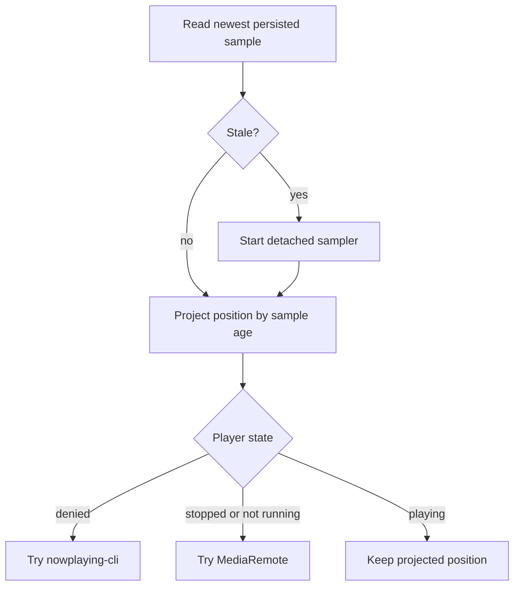
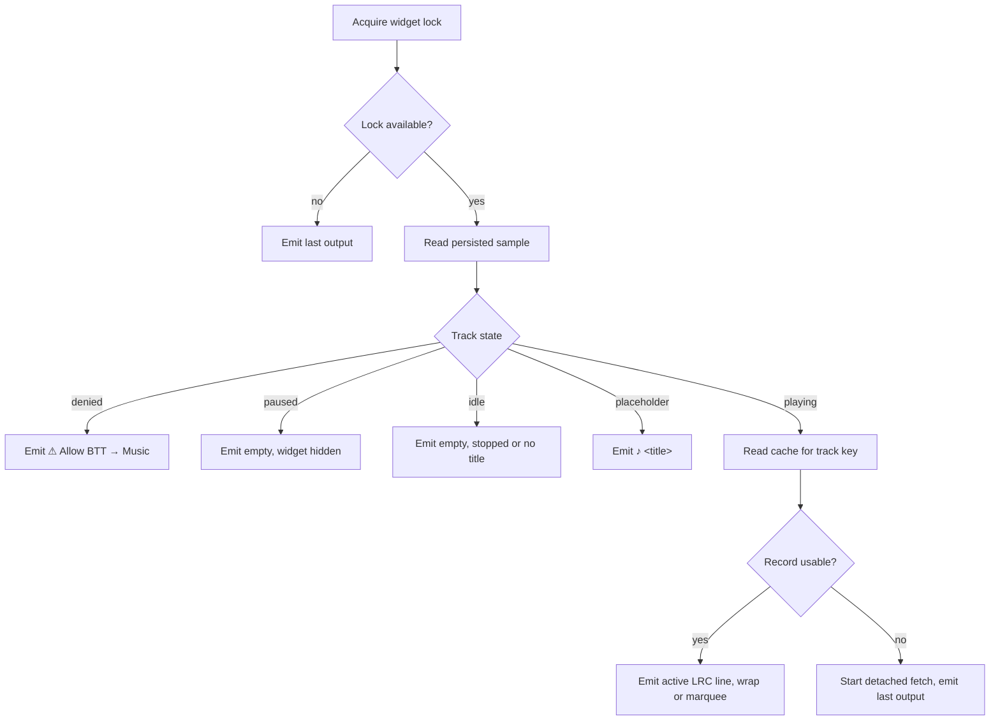
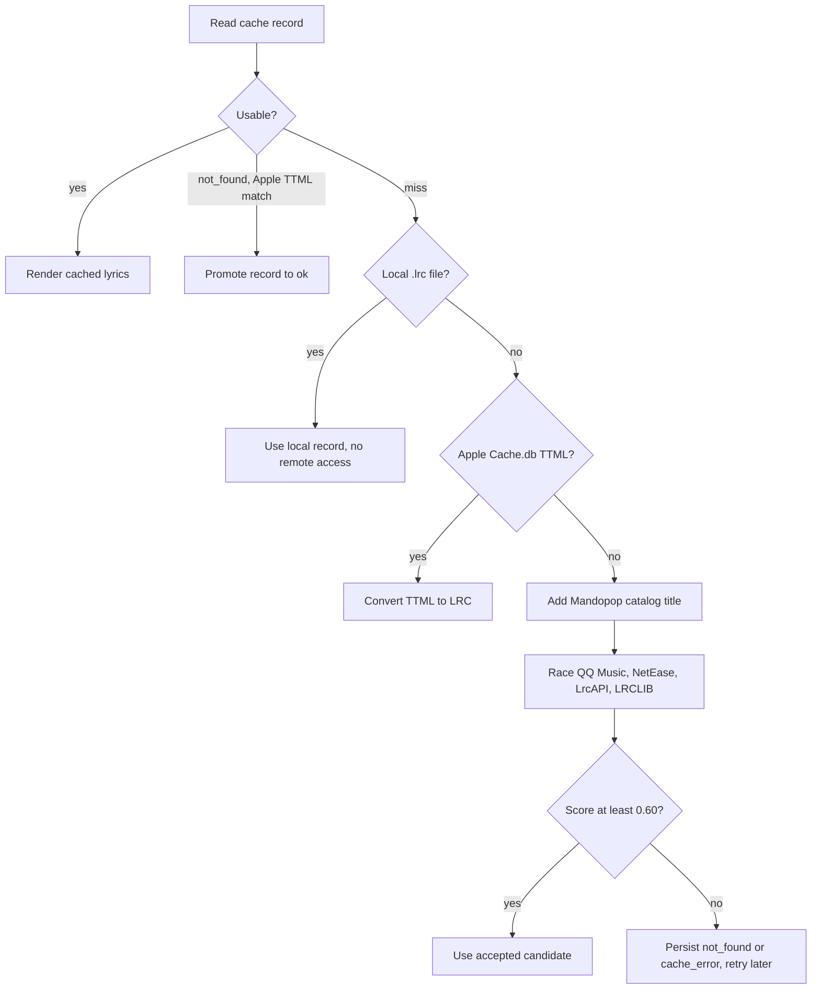
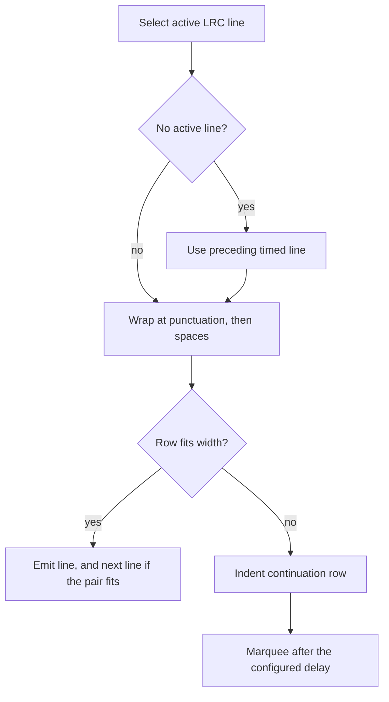
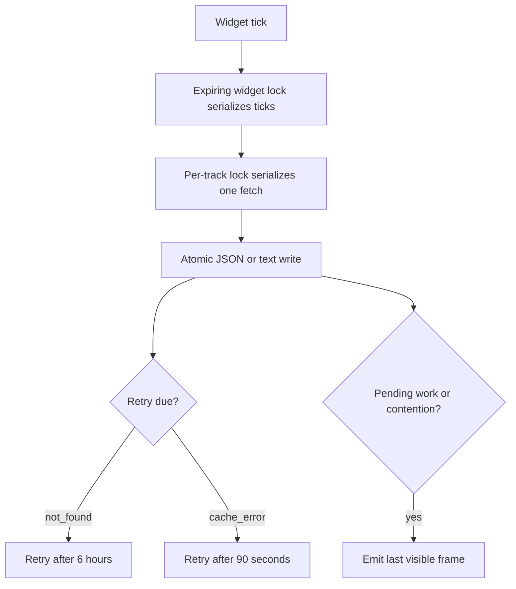
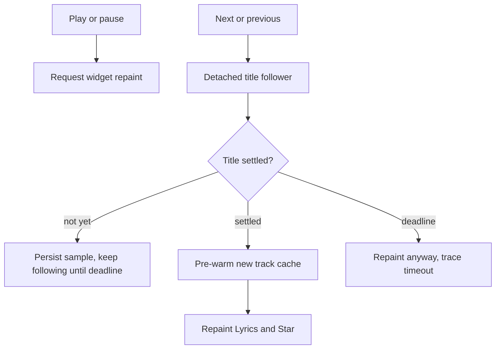
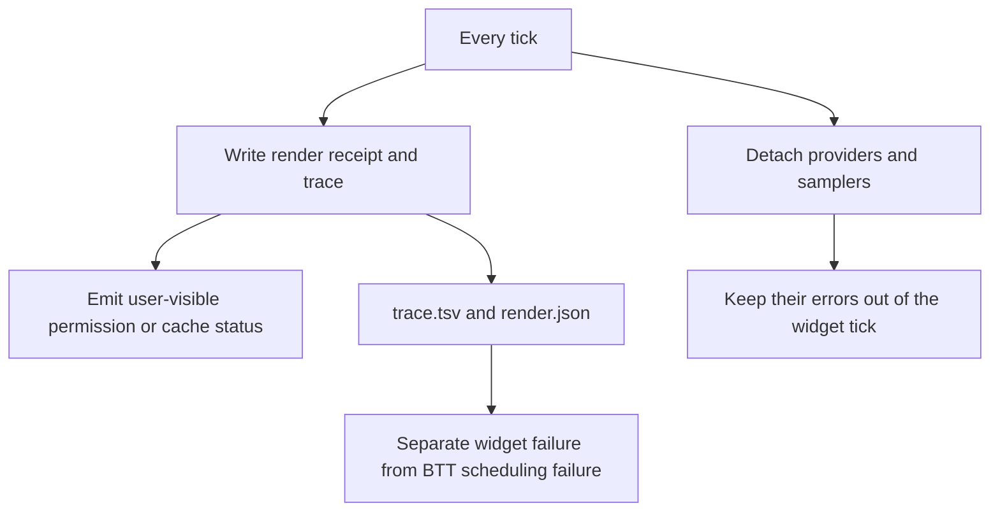
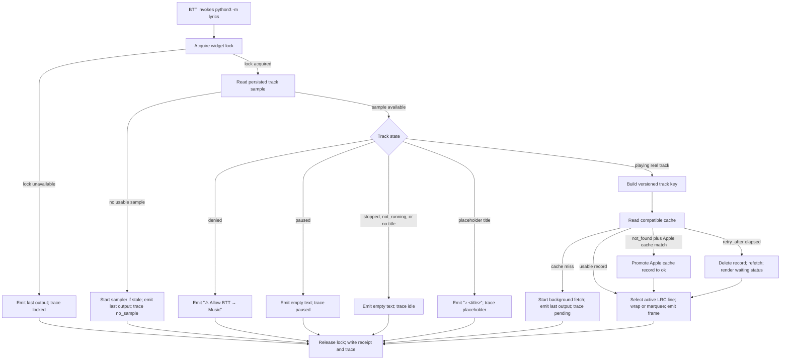
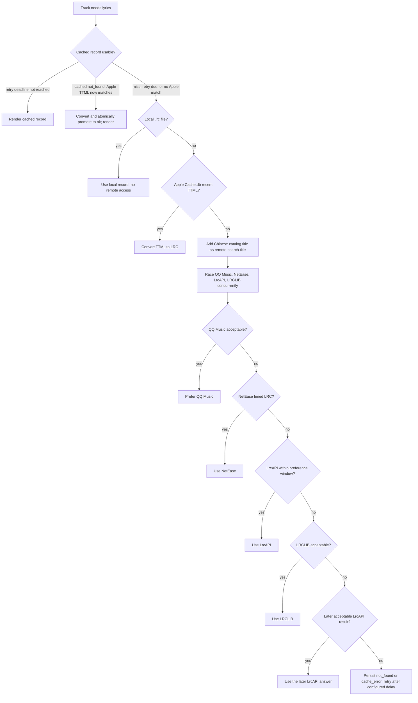

# Lyrics Feature Specification

Indexed from [`specs/FEATURES.md`](../FEATURES.md); the shared widget
lifecycle it does *not* use is
[`specs/design/WIDGET-RUNTIME.md`](WIDGET-RUNTIME.md), and the row it shares
is [`specs/design/NOW-PLAYING.md`](NOW-PLAYING.md).

## Reconstruction Target

This document preserves the behaviour needed to rebuild the Lyrics Touch Bar
feature: how BetterTouchTool invokes it, how playback state becomes a lyric
frame, how lyric sources are selected, and how slow or unavailable dependencies
are handled.

It is a behaviour contract rather than a file inventory. It records stable
module and script owners where they help reconstruction, but leaves provider
protocol details, BetterTouchTool's private implementation, and presentation
styling choices to the implementation unless they affect an observable
contract.

The feature boundary is:

```text
BetterTouchTool / Music / MediaRemote
        -> track sample and widget trigger
Lyrics package
        -> cached, synchronized, width-constrained frame
BetterTouchTool Touch Bar
```

## Entry Points

| Entry point | Intended user or trigger | Contract |
| --- | --- | --- |
| `widgets/now-playing-lyrics.sh` | BetterTouchTool's periodic script widget | Sets the package import path and executes `python3 -m lyrics` in default widget mode. |
| `python3 -m lyrics` | The default widget invocation | Renders one frame and exits without querying Apple Music directly. |
| `python3 -m lyrics --sample` | Detached sampler | Queries the available player and atomically persists the newest track sample. |
| `python3 -m lyrics --track-changed <uuid>` | `actions/track-changed.sh` after next/previous media input | Follows the asynchronous track transition, pre-warms lyrics, and requests a final repaint. |
| `python3 -m lyrics --fetch <key>` | Detached cache worker | Fetches and persists one track's lyric record. |
| `python3 -m lyrics --report`, `--watch`, `--diagnose` | Operator diagnostics | Reads render and trace state to inspect widget health. |
| `python3 -m lyrics --clear-current` | Operator or recovery action | Clears current lyric output/state according to the CLI implementation. |
| BetterTouchTool `refresh_widget` | Tap, play/pause, or track-change action | Causes BTT to invoke the widget again; the refresh request is asynchronous from shell actions. |

The production widget is configured in
[`bttpreset/Default.bttpreset`](../../bttpreset/Default.bttpreset). The shell
entry point is [`widgets/now-playing-lyrics.sh`](../../widgets/now-playing-lyrics.sh),
and the track-change bridge is
[`actions/track-changed.sh`](../../actions/track-changed.sh).

## Feature Tree

### [Keep playback context current](#playback-sampling)



### [Render the correct playback state](#main-render-flow)



### [Find lyrics with bounded work](#lyric-source-dispatch)



### [Fit lyrics beside Now Playing](#lrc-and-fixed-width-rendering)



### [Survive repeated one-second ticks](#main-render-flow)



### [Respond to user actions](#track-change-flow)



### Explain failures



## Decision Trees

### Main Render Flow

The normal widget tick is a synchronous, bounded decision over persisted
state. Samplers and lyric fetches are detached so the tick does not wait for
AppleScript or network work.



The lock is released and the render receipt is written in the `finally` path,
including a crash outcome. This is an operational invariant: a failed tick
must not leave the widget permanently locked.

### Playback Sampling

A sample is the newest persisted snapshot of the active player, written by a
detached sampler: track identity (title, artist, album), duration, playback
state, and position. The widget tick reads the snapshot and makes three
decisions from it: the state gate (denied, paused, idle, placeholder, or
playing), the track identity that builds the versioned cache key, and the
playback position that selects the active LRC line. Position is the
lyric-sync input — the tick projects it forward from the sample, so
synchronisation never requires a live position query.

| Input or condition | Selected path | Observable result |
| --- | --- | --- |
| Persisted sample is younger than the refresh threshold | Project playback using sample age | The position advances without an AppleScript call in the widget tick. |
| Sample is old but still within the maximum usable age | Start a detached sampler and use the old sample | The current frame remains usable while fresh state is acquired. |
| Sample is older than the usable-age limit or absent | Start a sampler and return no usable track | The last rendered frame is reprinted; no blank intermediate frame is introduced. |
| Apple Music responds with permission denied | Try `nowplaying-cli` | A usable alternate sample may continue playback; otherwise the denied state is rendered. |
| Music is stopped or not running | Try MediaRemote | A non-Music player may supply the track; otherwise the widget becomes idle. |
| AppleScript fails for a reason other than permission denial | Keep the previous sample | The widget avoids replacing valid state with an unverified failure. |
| MediaRemote changes title or artist | Reset its locally tracked position | Subsequent playback position starts from the new track's sample. |
| MediaRemote reports a new raw elapsed time | Re-anchor the projected position to it | QQ Music refreshes this field on seek/pause/resume/restart, so in-player seeks are followed on the next sample. |
| MediaRemote playback rate lies while paused | Use the framework's own isPlaying state (nowplaying-state helper) | QQ Music pushes playbackRate 1 even while paused, so the rate alone cannot distinguish pause from play; the helper reads the same source Control Center's Now Playing tile does, and the lyric holds instead of scrolling through a paused track. |

Playback state is persisted atomically as a current snapshot. It is not a
history of tracks; lyric history belongs in per-track cache records.

### Track-Change Flow

`actions/track-changed.sh` must be detached from the BTT shell action because
waiting in the shared runner can block other widgets.

| Branch | Condition | Result |
| --- | --- | --- |
| Start | Next/previous action supplies the Lyrics UUID | Follow Apple Music samples at the configured interval. |
| Settling | Title is empty, unchanged, or a known placeholder | Persist the sample, continue until the deadline, and allow a repaint of position/state. |
| Settled | Title differs from the previous title and is not a placeholder | Pre-warm the track if its cache is absent, request a BTT repaint, and trace `settled`. |
| Timeout | Deadline expires without a settled title | Request a repaint anyway and trace `timeout`; do not invent a track identity. |
| Sampling error | One sample raises an exception | Log the failure, wait for the next interval, and keep following until settled or timeout. |

The small example command is the actual action shape:

```sh
actions/track-changed.sh <lyrics-widget-uuid> <star-widget-uuid>
```

The generic `tap-refresh.sh` call creates `.force` files for supplied UUIDs,
but the Python Lyrics path responds to the actual `refresh_widget` request and
does not call the shared shell `btt_force_pending()` consumer. Therefore
Lyrics and Star force markers are coordination residue rather than a required
part of their refresh contract.

### Lyric Source Dispatch

| Order | Decision | Next path |
| --- | --- | --- |
| 1 | A compatible cache record exists and its retry deadline has not arrived | Render the cached record. |
| 2 | A cached `not_found` record now has a matching Apple Music TTML record | Convert and atomically promote the local record to `ok`, then render it. |
| 3 | A local `.lrc` record matches | Use the local record without remote access. |
| 4 | Apple Music's `Cache.db` contains matching recent TTML | Convert TTML to LRC and use it. |
| 5 | A Chinese catalog title is available | Add it as the remote search title, without replacing the original track identity. |
| 6 | QQ Music returns an acceptable result | Prefer QQ Music. |
| 7 | QQ Music misses or fails | Await NetEase's timed LRC. |
| 8 | NetEase misses or fails | Await LrcAPI within its preference window, then LRCLIB, then a later acceptable LrcAPI result if available. |
| 9 | No provider returns an acceptable result | Persist `not_found` or `cache_error` according to the failure, then retry after its configured delay. |

The dispatch shape is a fork chain: cached state first, then the concurrent
provider race.



Provider lookup is bounded and concurrent. QQ Music, NetEase, LrcAPI, and
LRCLIB are started together; provider-specific query retries must not turn the
one-second widget tick into a blocking network request. QQ Music and NetEase
fill the gap left when LRCLIB only carries plain text for a Chinese track (its
even-spread LRC is a stopgap, never a sync) and LrcAPI is silent; their public
lyric endpoints usually have genuinely timed LRC for those tracks. QQ Music's
lyric endpoint rejects requests without a y.qq.com referer. LRCLIB is a
keyless community database and the strongest source for English and
non-Chinese tracks, including outside China; LrcAPI is a Chinese-source
aggregator (KuGou and an Apple Music data source among others) that fills the
Chinese long tail after the two primary catalogs miss. Those roles — and
LrcAPI's third-party hosting — are why they run after QQ Music and NetEase.

### Candidate Acceptance

For every provider candidate:

1. Normalize title, artist, album, and relevant aliases.
2. Require synchronized lyrics or an explicit instrumental result.
3. Score title, artist, album, and duration similarity.
4. Accept only a score of at least `0.60`.
5. Continue to the next candidate/provider when the candidate is rejected.

An accepted result is a track association, not merely valid LRC syntax. A
provider response that parses but belongs to another recording must remain
unaccepted.

### LRC and Fixed-Width Rendering

| Input | Decision | Result |
| --- | --- | --- |
| No active line at the current position | Select the preceding timed line when available | Keep the lyric frame synchronized to playback. |
| Line fits the fixed width | Emit the line, and the next line when the pair fits | Use the compact two-line frame. |
| Line is too wide | Break at punctuation, then spaces | Preserve readable rows up to the two-row limit. |
| A row still exceeds width | Crop/marquee according to elapsed playback time | Scroll at the configured cell rate after the delay. |
| Track has no synchronized lyrics but is instrumental | Render the instrumental marker, faded with playback progress | Emit widget JSON `{"text": "♬", "font_color": "r,g,b,a"}` with `r=g=b` fading 255→80 gray over the track. |
| Track is not found | Render the not-found marker, faded with playback progress | Emit widget JSON `{"text": "♩", "font_color": "r,g,b,a"}` with `r=g=b` fading 255→80 gray over the track. |
| A provider fetch fails | Render the unavailable marker | Emit `♪ Lyrics unavailable`; Apple-cache read failures are logged and degrade to a miss, so the marker never reads as an Apple Music problem. |

LRC parsing must preserve timestamp semantics: offsets, enhanced timestamps,
multiple timestamps on one line, sorting, and same-timestamp deduplication.

## Journey Contracts

### One Widget Tick

**Input:** an invocation of `python3 -m lyrics` with a persisted track sample,
cache directory, and optional previous output.

**Transformation:**

```text
sample -> state gate -> track key -> cache lookup
       -> background work when needed -> LRC line selection
       -> width-constrained output
```

**Outputs:** one text frame to stdout, plus a render receipt and trace record.
Empty text is meaningful: BetterTouchTool hides the script widget when the
player is paused or idle.

**Invariants:**

- A widget tick does not directly call Apple Music or remote providers.
- At most one widget tick owns `widget.lock` at a time.
- A cache miss preserves the previous frame while fetch work runs.
- Lock release, receipt writing, and trace writing occur on both success and
  failure paths.
- Reads never observe partial JSON/text because state writes are atomic.

**Examples:**

```text
state=paused          -> stdout: ""; trace outcome: paused
state=denied          -> stdout: "⚠ Allow BTT → Music"
placeholder track    -> stdout: "♪ <title>"
missing lyric cache   -> previous stdout; trace outcome: pending
```

### Track Fetch

**Input:** a real track metadata record and its versioned cache key.

**Transformation:** local LRC -> Apple Music TTML cache -> catalog-assisted
remote lookup -> concurrent QQ Music/NetEase/LrcAPI/LRCLIB candidate selection.

**Outputs:** an atomically written record with one of the supported outcomes:
usable lyrics, instrumental, `not_found`, or `cache_error`.

**State and timing:** positive and instrumental records are reusable;
`not_found` retries after six hours and `cache_error` retries after 90 seconds.
The fetch deadline and per-track lock bound concurrent work.

**Failure recovery:** malformed cache JSON is logged and removed; provider
exceptions become a persisted cache error or a later provider fallback; a
later Apple Music cache match can revive a previous `not_found` record.

### Track-Change Repaint

**Input:** a next/previous media action and the Lyrics widget UUID.

**Transformation:** detached polling samples -> title-settlement decision ->
optional cache pre-warm -> BTT `refresh_widget`.

**Outputs:** the next widget tick sees the new persisted track, and diagnostics
record either `settled` or `timeout`.

**Properties:** detached, bounded to the configured follow deadline, safe to
repeat, and non-blocking to the BTT shell runner.

### Durable and Ephemeral State

| State class | Examples | Semantics |
| --- | --- | --- |
| Reusable durable state | Per-track lyric JSON, `state.json`, `last.txt`, `lyrics.value`, `media_remote_position.json` | Survives a process and avoids repeating expensive work. |
| Diagnostic durable state | `error.log`, `logs/lyrics/trace.tsv`, `logs/lyrics/render.json` | Explains outcomes and separates widget failures from BTT scheduling failures. |
| Ephemeral coordination | `widget.lock`, `sampler.lock`, per-track locks, detached helpers, fetch deadlines | Prevents overlap and bounds work; stale locks are recoverable. |
| Integration residue | BTT UUID `.force` files | Intended for shared shell widgets; Lyrics and Star currently do not consume them. |

State writes must be atomic where another process can read the file during a
tick. Current-snapshot state may be overwritten by a newer sample; per-track
cache records are keyed so one track cannot replace another track's lyrics.

## Implementation Map

| Contract | Stable owner |
| --- | --- |
| Package entry and CLI dispatch | [`widgets/lyrics/__main__.py`](../../widgets/lyrics/__main__.py), [`widgets/lyrics/cli.py`](../../widgets/lyrics/cli.py) |
| BTT shell integration | [`widgets/now-playing-lyrics.sh`](../../widgets/now-playing-lyrics.sh), [`bttpreset/Default.bttpreset`](../../bttpreset/Default.bttpreset) |
| Track sampling and player fallback | [`widgets/lyrics/sources/apple_music.py`](../../widgets/lyrics/sources/apple_music.py), [`widgets/lyrics/sources/media_remote.py`](../../widgets/lyrics/sources/media_remote.py), [`widgets/lyrics/cli.py`](../../widgets/lyrics/cli.py) |
| Main state machine and output decisions | [`widgets/lyrics/display/render.py`](../../widgets/lyrics/display/render.py) |
| Widget lock, helper spawning, retry display timing | [`widgets/lyrics/runtime/locking.py`](../../widgets/lyrics/runtime/locking.py) |
| Cache identity and atomic persistence | [`widgets/lyrics/runtime/cache.py`](../../widgets/lyrics/runtime/cache.py), [`widgets/lyrics/text/metadata.py`](../../widgets/lyrics/text/metadata.py) |
| Provider order and bounded concurrency | [`widgets/lyrics/fetch.py`](../../widgets/lyrics/fetch.py), [`widgets/lyrics/runtime/concurrency.py`](../../widgets/lyrics/runtime/concurrency.py) |
| Local LRC and Apple Music cache adapters | [`widgets/lyrics/providers/local.py`](../../widgets/lyrics/providers/local.py), [`widgets/lyrics/providers/apple_cache.py`](../../widgets/lyrics/providers/apple_cache.py) |
| Remote provider adapters | [`widgets/lyrics/providers/qqmusic.py`](../../widgets/lyrics/providers/qqmusic.py), [`widgets/lyrics/providers/netease.py`](../../widgets/lyrics/providers/netease.py), [`widgets/lyrics/providers/lrcapi.py`](../../widgets/lyrics/providers/lrcapi.py), [`widgets/lyrics/providers/lrclib.py`](../../widgets/lyrics/providers/lrclib.py) |
| Candidate normalization and acceptance | [`widgets/lyrics/text/metadata.py`](../../widgets/lyrics/text/metadata.py), [`widgets/lyrics/text/matching.py`](../../widgets/lyrics/text/matching.py) |
| LRC parsing and active-line selection | [`widgets/lyrics/text/lrc.py`](../../widgets/lyrics/text/lrc.py), [`widgets/lyrics/display/layout.py`](../../widgets/lyrics/display/layout.py) |
| Output shaping and last-frame preservation | [`widgets/lyrics/runtime/output.py`](../../widgets/lyrics/runtime/output.py) |
| Track-change workflow | [`actions/track-changed.sh`](../../actions/track-changed.sh), [`widgets/lyrics/cli.py`](../../widgets/lyrics/cli.py) |
| Runtime diagnostics | [`widgets/lyrics/diag/diagnostics.py`](../../widgets/lyrics/diag/diagnostics.py), [`widgets/lyrics/diag/debug.py`](../../widgets/lyrics/diag/debug.py) |

## Verification Map

`tests/run.sh` runs the suite on stdlib `unittest` alone — the widgets run
under whatever `python3` BetterTouchTool's PATH finds, with no site-packages,
so the tests need nothing installed either. Every `lyrics.config` path is
redirected into a temporary sandbox before Python starts, so a run never
touches `cache/lyrics` or `logs/`.

```sh
tests/run.sh                    # everything
tests/run.sh lyrics.test_lrc    # one module
```

The pure decisions are covered; the detached processes and BTT integration
are not, and remain observational.

| Behaviour to verify | Focused evidence |
| --- | --- |
| Cache safety | [`tests/lyrics/test_cache.py`](../../tests/lyrics/test_cache.py) — valid, malformed, `not_found`, and `cache_error` records; atomic replacement, cleanup, retry deadlines. |
| Matching | [`tests/lyrics/test_matching.py`](../../tests/lyrics/test_matching.py), [`tests/lyrics/test_metadata.py`](../../tests/lyrics/test_metadata.py) — aliases, CJK normalization, duration differences, instrumental candidates, the `0.60` threshold. |
| LRC timing | [`tests/lyrics/test_lrc.py`](../../tests/lyrics/test_lrc.py) — offsets, enhanced timestamps, duplicate timestamps, empty intervals. |
| Layout | [`tests/lyrics/test_layout.py`](../../tests/lyrics/test_layout.py) — punctuation/space wrapping, two-row limits, continuation indentation, marquee delay and rate. |
| Concurrency and locking | [`tests/lyrics/test_concurrency.py`](../../tests/lyrics/test_concurrency.py), [`tests/lyrics/test_locking.py`](../../tests/lyrics/test_locking.py) — bounded provider racing; held and stale locks. |
| Output shaping | [`tests/lyrics/test_output.py`](../../tests/lyrics/test_output.py) — last-frame preservation and widget JSON. |
| State gate | Not covered. Feed denied, paused, idle, placeholder, and playing snapshots to the render decision and compare exact output/status strings. |
| Provider fallback | Not covered end to end. Make local, Apple cache, QQ Music, NetEase, LrcAPI, and LRCLIB paths succeed/fail in order; verify the first acceptable result wins. |
| Track changes | Not covered. Run `actions/track-changed.sh` with a synthetic UUID; verify detached execution, `settled`/`timeout`, pre-warm behaviour, and repaint request. |
| BTT integration | Not covered. Verify periodic invocation, play/pause clearing, track-change repaint, and widget hiding on empty output against the preset. |
| Diagnostics | Not covered. Compare `logs/lyrics/render.json`, `logs/lyrics/trace.tsv`, and the shared widget trace during a single-widget failure. |

Useful operator checks are `python3 -m lyrics --report`,
`python3 -m lyrics --diagnose`, and inspection of the render and trace files.
These are observational checks, not substitutes for deterministic unit tests.

## Retired: viewport measurement

**Retired 2026-08-13**: the detached JXA measurement worker
(`display/viewport.py`, `display/text_width.js`, `--measure`) and per-track
`viewport.json` metrics were removed. Width is now a fixed cell count —
`config.LYRIC_WIDTH_CELLS`, defaulting to the widget's 400 px slot at
`BTT_LYRICS_PX_PER_CELL` px per cell, overridable with `BTT_LYRICS_WIDTH` —
and character widths come from the east-asian-width heuristic in
`display/layout.py`. The removed files and `tests/lyrics/test_viewport.py`
are recoverable from git history if per-track measured widths are wanted
again.

## Known Gaps

- The render state machine, provider fallback order, track-change flow, and BTT
  integration have no automated tests; those branch contracts are reconstructed
  from implementation and operational evidence rather than regression-tested.
- The exact BetterTouchTool scheduling and `refresh_widget` guarantees are
  external behaviour. The repository can request a repaint but cannot prove BTT
  will dispatch it.
- Apple Music, `nowplaying-cli`, MediaRemote, QQ Music, NetEase, LrcAPI, LRCLIB, OpenCC, and
  Apple Music's `Cache.db` are external dependency boundaries. Their response
  schemas, permissions, rate limits, and availability need integration checks.
- `BTT_LYRICS_LOCAL_DIR`, widget UUID variables, cache paths, and timing values
  are configuration inputs; the accepted deployment values are not captured
  in one versioned configuration contract.
- `actions/tap-refresh.sh` creates `.force` markers for Lyrics and Star, but
  those widgets do not call the shared shell marker consumer. The intended
  cleanup/ownership decision remains open: remove those marker writes for
  non-shell widgets or implement an explicit consumer.
- MediaRemote seek observation relies on QQ Music refreshing the raw elapsed
  time on player events; players that never refresh it keep the projected
  clock, and Apple Music placeholder transitions are inherently asynchronous;
  callers must preserve `unknown`, `timeout`, and unavailable states rather
  than inventing track identity.
