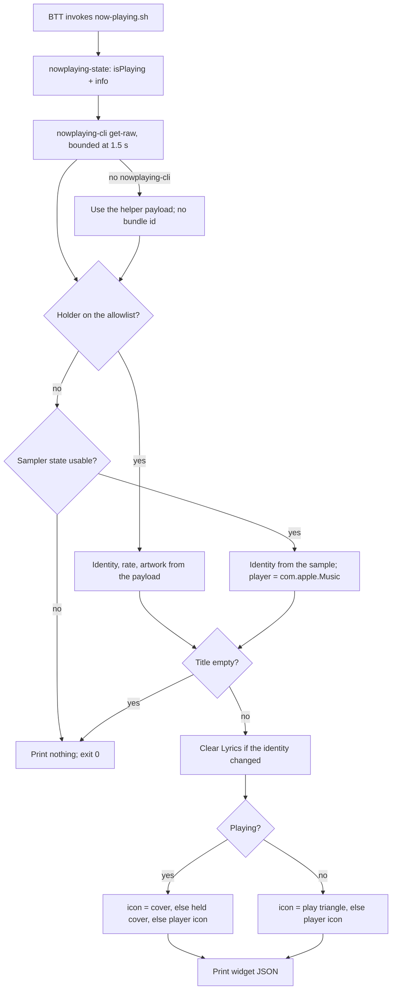

# Now Playing Feature Specification

Indexed from [`specs/FEATURES.md`](../FEATURES.md). The widget beside it is
[`specs/design/LYRICS.md`](LYRICS.md); the width rule both obey is in
[`specs/CONSTRAINTS.md`](../CONSTRAINTS.md).

## Reconstruction Target

This document preserves the behaviour needed to rebuild the Now Playing Touch
Bar widget: which player may own the row, how one BTT tick turns MediaRemote
state into two text rows and an icon, and how the widget hands the row over on
a track change.

It is a behaviour contract, not a file inventory. Font sizes, paddings, and
icon slot widths live in the preset and are excluded; so is MediaRemote's
private protocol beyond the keys read below.

The feature boundary is:

```text
MediaRemote (nowplaying-cli, nowplaying-state) + the Lyrics sampler's state
        -> allowlist gate, playing flag, artwork
now-playing.sh
        -> two rows + icon, or nothing
BetterTouchTool Touch Bar
```

The widget exists because the native BTT Now Playing widget follows whichever
app owns the system session — a browser playing YouTube included — and BTT
offers no per-app filter for it. The replacement ships under the same UUID, so
`BTT_WIDGET_NOW_PLAYING_UUID` keeps working.

## Entry Points

| Entry point | Intended user or trigger | Contract |
| --- | --- | --- |
| `widgets/now-playing.sh <widget-uuid>` | BTT shell script widget, 1 s interval | Prints one widget JSON object, or nothing; may clear the Lyrics widget as a side effect. |
| `widgets/now-playing.sh` | Terminal, operator | Prints the same two rows as plain text and touches no state — no identity file, no clear, no icon path. |
| BTT tap (`Play or Pause`, then async AppleScript) | User | BTT toggles playback and refreshes the Lyrics widget (or clears its text when paused). |
| BTT long press (`Toggle Music Group` named trigger) | User | Opens or closes the `Music` Touch Bar group; Now Playing is merged into groups, so the same press closes the group from inside it. |

The widget is configured in
[`bttpreset/Default.bttpreset`](../../bttpreset/Default.bttpreset) as trigger
`710F54C5-25B0-4A2C-B960-D9C0FE78B1B7`, `BTTTouchBarScriptUpdateInterval` 1.

### Configuration Inputs

| Variable | Default | Meaning |
| --- | --- | --- |
| `BTT_NOW_PLAYING_ALLOWED` | `com.apple.Music com.tencent.QQMusicMac` | Space-separated bundle ids allowed to hold the row, compared case-folded. The Lyrics sampler's MediaRemote fallback honors the same knob (minus `com.apple.Music`, which the sampler reads directly). |
| `BTT_LYRICS_WIDGET_UUID` | `E19BB023-5060-4A56-95C8-6E7402779870` | Lyrics widget cleared on a track change; defaulted rather than passed in, so the widget survives a preset that was never re-imported. |
| `BTT_WIDGET_CACHE_DIR` | `$BTT_REPO_DIR/cache` | Artwork, player icons, identity file, clear marker. |
| `BTT_LYRICS_CACHE_DIR` | `$BTT_REPO_DIR/cache/lyrics` | Where `state.json` — the sampler fallback — is read from. |
| `BTT_NOW_PLAYING_STATE_BIN` | `~/Library/Application Support/BTT/nowplaying-state` | Compiled `isPlaying` helper; built from `actions/nowplaying-state.m`. |

## Feature Tree

```text
Now Playing widget
├── Decide whose track the row shows
│   ├── Read MediaRemote's holder bundle id (nowplaying-cli get-raw)
│   ├── Accept a holder on the allowlist, case-folded
│   ├── Fall back to the Lyrics sampler when a browser holds the session
│   └── Print nothing when neither names an allowed player
├── Decide whether it is playing
│   ├── Prefer the nowplaying-state helper's isPlaying flag
│   ├── Require the helper to describe the same title as the row
│   └── Fall back to the published playback rate
├── Draw the row
│   ├── Strip parenthetical suffixes from the title
│   ├── Keep only the first work of a multi-work album
│   ├── Place the album by the minimax rule (narrower widest row wins)
│   └── Drop the second row when artist and album are both empty
├── Draw the icon
│   ├── Album cover from the payload, cached per track by content hash
│   ├── Hold the previous cover through a payload that omits artwork
│   ├── The player app's own icon when the track carries no cover
│   └── A play triangle while paused
└── Hand the row over on a track change
    ├── Compare the track identity with the previous tick's
    ├── Clear the Lyrics widget before the row reflows
    ├── Leave a marker the Lyrics tick honours
    └── Record the new identity last
```

## Decision Trees

### One Widget Tick



A holder outside the allowlist is not the same as nothing playing. A browser
that starts a video takes the system session over while Apple Music keeps
playing, and gating on the holder alone blanked the row for as long as the tab
lived — hence the sampler fallback.
[`actions/now-playing-app.sh`](../../actions/now-playing-app.sh) makes the
same fallback for the Star widget, so the two agree on whose track the row is
showing.

### Source Selection

| Condition | Selected path | Observable result |
| --- | --- | --- |
| Holder's bundle id is in the allowlist (case-folded) | MediaRemote payload | Title, artist, album, artwork, and playback rate all come from one dictionary. |
| Holder is anything else, sampler sample is fresh (≤ 8 s), `state` is `playing` or `paused`, and `source` is `apple_music` | Lyrics sampler `state.json` | The row keeps naming Apple Music; `player` becomes `com.apple.Music` and there is no cover, so the app icon stands in. |
| Sampler `source` is `media_remote` | Rejected | Those samples come from the very holder just rejected; accepting them would undo the allowlist. |
| `com.apple.music` is not in the allowlist | Rejected | The fallback cannot smuggle in a player the operator excluded. |
| Sample missing, malformed, or older than 8 s | Rejected | Nothing prints; BTT hides a script widget whose text is empty. |
| `nowplaying-cli` is absent | Helper payload only | The helper omits the holder's bundle id, so the gate fails closed — degraded, never a wrong player. |

`SAMPLE_MAX_AGE_SECONDS` (8.0) mirrors `STATE_MAX_AGE_SECONDS` in
`widgets/lyrics/config.py`, which is what the Lyrics widget itself allows
before treating a sample as gone.

### Playing Or Paused

`kMRMediaRemoteNowPlayingInfoPlaybackRate` is not a playback state: QQ Music
keeps publishing rate 1 while paused and never republishes on a pause —
measured at 9 s of rate 1 after BTT's own Play or Pause action — so the rate
alone left the album cover on screen where the play icon belongs.

| Helper answer | Result |
| --- | --- |
| `isPlaying` present and its title equals the row's title | Use `isPlaying`. |
| Helper missing, unreadable, or describing a different title | Fall back to `rate > 0`. |

The title check matters because the two readings are a moment apart, and a
stale flag from the previous track is worse than the rate it falls back to.
[`specs/design/LYRICS.md`](LYRICS.md) records the same finding for the lyrics
sampler, which is why the helper exists at all.

### Icon Selection

| State | Order tried | Notes |
| --- | --- | --- |
| Playing | payload artwork → held cover → player app icon | A bare text row leaves the reader nothing to place the track by. |
| Paused | `assets/now-playing-play.svg` → generated PNG → player app icon | Matches the native widget's `HideWhenPaused: 0`: still showing the track, but signalling it is not moving. |

- **Payload artwork.** Base64 under `kMRMediaRemoteNowPlayingInfoArtworkData`,
  sniffed as JPEG (`ff d8 ff`) or PNG (`89 50 4e 47`) and written to
  `cache/now-playing-artwork-<sha256[:12]>.<ext>`. The name is hashed from the
  bytes so BTT sees a new path per track instead of a stale icon; every other
  `now-playing-artwork-*` file is removed on write.
- **Held cover.** QQ Music leaves the artwork out of the occasional payload
  while playing (measured: one tick in a few dozen). When
  `cache/now-playing.identity` still names the track on screen, the artwork
  file on disk is reused rather than dropping to the player logo for one tick
  and back, which reads as a flicker.
- **Player app icon.** See the journey contract below.
- **Play triangle.** The checked-in SVG is preferred because BTT renders SVG
  `icon_path` files; if it is missing, a 32×32 white triangle on transparency
  is generated once into `cache/now-playing-play.png` with `zlib` and `struct`
  alone, so the widget needs no image tools.

### Row Layout

1. `title` — parenthetical groups removed, whitespace collapsed:
  `Song (feat. X)` → `Song`.
2. `album` — `strip_parens`, then only the text before the first `;`.
   Multi-work albums (`Mozart: Piano Concerto No. 23 K. 488; Piano Sonata
   K. 333`) do not fit the Touch Bar, so only the first work is shown.
3. The two stock rows draw one of two layouts, chosen by a minimax width
  rule: `{title}` over `{artist} - {album}`, or `{album} - {title}` over
  `{artist}` — whichever has the narrower widest row. Row widths are
  estimated in layout cells (narrow glyph 1, CJK/wide 2, the same model as
  the Lyrics widget); the first row renders at the widget's configured font
  size (13 px), the second at the remainder of BTT's fixed 22 px two-row
  block (9 px). The widget's own `BTTTBWidgetWidth` bounds each row, and
  BTT truncates past it.
4. Empty parts are dropped from their rows, and a fully empty second row is
  dropped entirely.

## Journey Contracts

### One Widget Tick

**Input:** an optional widget UUID, the MediaRemote payloads, and the
sampler's `state.json`.

**Transformation:**

```text
helper isPlaying + raw dict -> allowlist gate -> identity
       -> playing flag -> icon choice -> row formatting -> stdout
```

**Outputs:** one JSON object on stdout in BTT mode, plain text in terminal
mode, or nothing at all. Exit status is 0 in every branch, including the
branches that print nothing.

**Invariants:**

- No AppleScript on the widget path. Every widget shares one BTT script-runner
  service, so a blocking call here stops every other widget
  ([`specs/CONSTRAINTS.md`](../CONSTRAINTS.md)).
- `nowplaying-cli` is bounded at 30 × 0.05 s and then killed; it can hang when
  no app holds a session.
- The gate fails closed: any doubt about the holder prints nothing.
- Terminal mode is read-only — it never writes the identity file, never clears
  Lyrics, and never emits `icon_path`.

**Examples:**

```console
$ widgets/now-playing.sh
神的遊戲 ▸ 艷火
Deserts Chang
```

```json
{"text": "神的遊戲 ▸ 艷火\nDeserts Chang", "font_color": "255,255,255,255",
 "icon_path": ".../cache/now-playing-artwork-ddc1655b58a0.jpg"}
```

A holder outside the allowlist with no usable sample prints nothing at all,
and BTT removes the widget from the row.

### Track Handover

**Input:** this tick's identity and `cache/now-playing.identity`.

**Transformation:** compare → clear the Lyrics widget → record the identity.

**Outputs:**

```json
// cache/now-playing.identity — the track currently on screen
{"title": "艷火 (Pyrojewel)", "artist": "Deserts Chang", "album": "神的遊戲"}

// cache/lyrics-cleared — the track whose lyric was just cleared
{"title": "…", "artist": "…", "album": "…", "at": 1786549413.0485618}
```

**Why:** this widget's text is what sets the pair's width, so a track change
here is what makes the whole row reflow — and the lyric beside it still
belongs to the track leaving the screen. Clearing it first collapses two
visible jumps (an old lyric beside the new row, then the lyric returning at
its own new width) into one.

**Properties:**

- Identity fields are the raw MediaRemote values with surrounding whitespace
  trimmed and nothing else, exactly as the Lyrics samplers name a track
  (`widgets/lyrics/sources/`), or the marker cannot be matched against the
  Lyrics widget's own state.
- Both JSON writes go to a `<name>.<pid>` temporary and are renamed into
  place, because the Lyrics widget reads the marker on a tick of its own and a
  torn read would drop the hold it exists to keep.
- The `osascript` clear is fire-and-forget (`Popen`, `start_new_session`): a
  launch costs ~200 ms, and every widget shares one script-runner service.
- Idempotent and symmetric. The Lyrics watchers run the same sequence from the
  other side of the transition (`cli.closing_sequence`), because either side
  may notice first — this widget reads MediaRemote on BTT's tick, the sampler
  reads Music over AppleScript on its own. Whichever gets there first wins.
- The identity file is written **last**, so a tick that dies before the clear
  goes out retries rather than recording a change it never made.
- Nothing is cleared when the previous identity has no title: coming back from
  an empty row has no stale lyric to clear, and a marker naming no track would
  match no sample anyway.

### Player Icon Extraction

**Input:** a bundle id and the cache directory.

**Transformation:** `mdfind kMDItemCFBundleIdentifier == '<id>'` → the app's
`Info.plist` `CFBundleIconFile` (defaulting to `AppIcon`, with or without the
`.icns` suffix) → the `.icns` faces → one embedded PNG.

**Outputs:** `cache/now-playing-player-<bundle-id>.png`, e.g.
`now-playing-player-com.tencent.QQMusicMac.png`.

**Properties:**

- Face choice: the smallest face at least 64 px wide, or the largest when
  every face is smaller. BTT scales it into a 30 px slot, so that face is
  already sharper than the slot.
- Modern `.icns` files store each face as a whole PNG, so the face is lifted
  out with `struct` alone — no `sips` subprocess on the tick path. Ancient
  uncompressed faces are skipped.
- Bounded: the Spotlight query gets 1.5 s, matching what the widget already
  allows `nowplaying-cli`.
- Negative caching: a failed lookup touches
  `cache/now-playing-player-<id>.miss` and is not retried for 300 s. Without
  it, a player whose icon cannot be read (Spotlight off, so `mdfind` cannot
  place the app) would pay a subprocess every second. Minutes rather than
  hours, because the same marker absorbs a cold Spotlight query that simply
  ran past the bound, and that one deserves a prompt retry.
- A bundle id becomes part of a Spotlight query string and of a cache file
  name, so only `[A-Za-z0-9][A-Za-z0-9._-]*` is accepted.
- Cached indefinitely: a player that updates its icon keeps the cached one
  until the file is removed, which is the right trade for a 30 px icon.

### State

| State class | Path | Semantics |
| --- | --- | --- |
| Reusable durable | `cache/now-playing-artwork-<hash>.<ext>` | One file at a time; superseded covers are unlinked on write. |
| Reusable durable | `cache/now-playing-player-<bundle-id>.png`, `cache/now-playing-play.png` | Written once, reused indefinitely. |
| Coordination | `cache/now-playing.identity` | The track on screen; drives both the handover and the held cover. |
| Coordination | `cache/lyrics-cleared` | Read by `render.cleared_while_sample_current` so the Lyrics sampler cannot repaint the old lyric a moment later. |
| Negative cache | `cache/now-playing-player-<bundle-id>.miss` | Empty file; only its mtime matters. |

## Implementation Map

| Contract | Stable owner |
| --- | --- |
| Whole widget | [`widgets/now-playing.sh`](../../widgets/now-playing.sh) |
| Playing flag source | [`actions/nowplaying-state.m`](../../actions/nowplaying-state.m), built to `~/Library/Application Support/BTT/nowplaying-state` |
| Paused icon asset | [`assets/now-playing-play.svg`](../../assets/now-playing-play.svg) |
| Sampler fallback producer | [`widgets/lyrics/cli.py`](../../widgets/lyrics/cli.py), [`widgets/lyrics/sources/apple_music.py`](../../widgets/lyrics/sources/apple_music.py) |
| Clear marker consumer | [`widgets/lyrics/display/render.py`](../../widgets/lyrics/display/render.py) |
| Same holder fallback, for the Star widget | [`actions/now-playing-app.sh`](../../actions/now-playing-app.sh) |
| Tap and long-press wiring | [`bttpreset/Default.bttpreset`](../../bttpreset/Default.bttpreset) |

Unlike every other shell widget, this one does **not** source
`widgets/lib/btt-widget.sh`: it has no value to cache and no refresh to
detach, and its icon and font colour are decided per tick. See
[`specs/design/WIDGET-RUNTIME.md`](WIDGET-RUNTIME.md) for what the shared
lifecycle offers the widgets that do.

## Verification Map

No automated tests cover this widget. The checks below are what a rebuild
should prove, and how to prove each one by hand today.

| Behaviour to verify | Focused evidence |
| --- | --- |
| Allowlist gate | Play a YouTube tab with Apple Music stopped; the widget prints nothing. `BTT_NOW_PLAYING_ALLOWED=com.apple.Music widgets/now-playing.sh` with QQ Music holding the session prints nothing. |
| Case folding | Confirm QQ Music (`com.tencent.QQMusicMac`) draws while the allowlist entry is spelled in any case. |
| Sampler fallback | With Apple Music playing and a browser holding the session, the row keeps the Music track and the icon falls back to the Music app icon. |
| Fallback cannot bypass the gate | Hand-write `cache/lyrics/state.json` with `"source": "media_remote"`; the widget must print nothing. |
| Sample ageing | Backdate `sampled_at` past 8 s; the fallback must stop. |
| Pause detection | Pause QQ Music and confirm the icon becomes the play triangle within a tick, not the album cover. |
| Artwork churn | Change tracks and confirm exactly one `now-playing-artwork-*` file remains, named after the new bytes. |
| Held cover | Delete nothing and force a payload without artwork mid-track; the cover must persist. |
| Handover | Change tracks and confirm `cache/lyrics-cleared` names the *previous* track and `cache/now-playing.identity` the new one. |
| Terminal purity | Run without a UUID and confirm no cache file changes mtime. |

## Known Gaps

- No automated tests. Every branch above is reconstructed from the
  implementation and from measurements recorded in its comments.
- The playback-rate lie is player-specific (QQ Music, measured). Players that
  publish an honest rate are covered by the same code but have not been
  exercised against the helper-missing fallback.
- `nowplaying-cli`, MediaRemote, and the compiled helper are external
  boundaries: the helper is not built by anything in this repo, and a machine
  without it silently degrades to rate-based detection.
- The widget reads `state.json` produced by the Lyrics feature, so the two are
  coupled through a file format that neither document owns as a schema.
- Layout balancing counts characters, not pixels, so a proportional-font tie
  can still pick the wider row on the bar.
