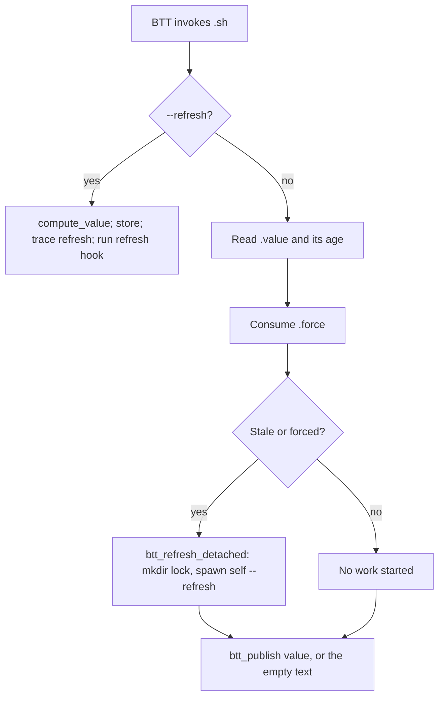

# Shared Widget Runtime Specification

Indexed from [`specs/FEATURES.md`](../FEATURES.md). The constraint this whole
design answers is in [`specs/CONSTRAINTS.md`](../CONSTRAINTS.md).

## Reconstruction Target

This document preserves the lifecycle every cached shell widget shares: how a
BTT tick reads a stored value instead of doing work, how the slow half runs
detached, how a widget colours itself, and what each run records. It is the
substrate for [`QUOTA.md`](QUOTA.md), [`CLASH.md`](CLASH.md), and
[`WEATHER.md`](WEATHER.md).

Per-widget value computation is excluded — that belongs to those documents.
[`NOW-PLAYING.md`](NOW-PLAYING.md) and [`LYRICS.md`](LYRICS.md) do not use this
runtime at all.

The rule the runtime exists to enforce: **BTT ships a single
`BetterTouchToolShellScriptRunner` XPC service and every shell script widget
goes through it**, so a widget that blocks for *n* seconds stops every other
widget for *n* seconds — and swallows their tap-refreshes too. Measured:
codexbar's Claude lookup takes ~43 s, during which the 1 s Lyrics widget
simply does not run. Anything touching the network is therefore computed by a
detached refresh that stores its result, and the widget path only ever reads
that stored value.

## Entry Points

| Entry point | Intended caller | Contract |
| --- | --- | --- |
| `source widgets/lib/btt-widget.sh` | Every cached widget script and two actions | Defines the cache, refresh, trace, colour, and publish helpers. Sets nothing off its own bat. |
| `btt_cached_widget_main <refresh_mode> <self> <max_age> <compute_fn>` | A widget's last line | Runs the whole lifecycle: refresh mode computes and stores, widget mode reads and publishes. |
| `<widget>.sh --refresh [uuid]` | The detached refresh this library spawns | Never invoked by BTT directly. |
| `actions/tap-refresh.sh [--delay-ms N] <uuid>...` | BTT tap actions | Raises each widget's force flag, then asks BTT to re-run those widgets. |

A widget declares itself with variables before calling the main function:

```sh
BTT_WIDGET_NAME="clash-latency"
BTT_WIDGET_REFRESH_MAX_RUN=60
btt_cached_widget_main "$REFRESH_MODE" "$SELF" "$VALUE_MAX_AGE" compute_value
```

`SELF="${0:A}"` is required: the detached refresh re-invokes the script, and
BTT may well have started it by a relative path.

### Configuration Inputs

| Variable | Default | Meaning |
| --- | --- | --- |
| `BTT_WIDGET_NAME` | — | Cache, lock, and trace identity. Required. |
| `BTT_WIDGET_UUID` | first positional argument, else unset | BTT mode when set; terminal mode when not. |
| `BTT_WIDGET_REFRESH_MAX_RUN` | `180` | How long a refresh may run before its lock is presumed dead. |
| `BTT_WIDGET_FORCE_MAX_AGE` | `10` | A force flag older than this belongs to a tap whose refresh never ran, and is dropped rather than obeyed. |
| `BTT_WIDGET_COLOR` | `255,255,255,255` | The normal label colour. |
| `BTT_WIDGET_DIM_COLOR` | `155,155,155,255` | Shown while this widget's refresh is in flight. |
| `BTT_WIDGET_QUOTA_DIM_COLOR` | `205,205,205,255` | The exhausted end of the quota gradient. |
| `BTT_WIDGET_COLOR_OVERRIDE` | — | Pins the colour and opts out of every state above, dim included. |
| `BTT_WIDGET_ICON` | — | Icon path, so a dimmed frame keeps its icon. |
| `BTT_WIDGET_EMPTY_TEXT` | `…` | Published when there is no cached value yet. |
| `BTT_WIDGET_REFRESH_HOOK` | — | Function called after a refresh stores its value, as `<hook> <started> <value>`. |
| `BTT_WIDGET_TRACE` | `1` | `0` turns tracing off. |
| `BTT_WIDGET_TRACE_MAX_BYTES` | `2000000` | Rotation threshold for the shared trace. |
| `BTT_WIDGET_CACHE_DIR` | `$BTT_REPO_DIR/cache` | All state files below. |
| `BTT_WIDGET_LOG_DIR` | `$BTT_LOG_DIR`, else `$BTT_REPO_DIR/logs` | Where `trace.tsv` lives. |

## Feature Tree

```text
Shared widget runtime
├── Keep the tick cheap
│   ├── Read the stored value and its age
│   ├── Publish a stale value rather than nothing
│   └── Never touch the network or AppleScript on the widget path
├── Do the slow work elsewhere
│   ├── Start at most one refresh per widget (mkdir lock)
│   ├── Reap a lock older than the refresh could possibly take
│   ├── Detach into a session of its own
│   └── Ask BTT to redraw, three times, only while BTT is alive
├── Answer a tap
│   ├── Consume the force flag on read
│   ├── Refresh even while the cached value is fresh
│   └── Ignore a flag older than its window
├── Say what state it is in
│   ├── Dim while a refresh is in flight
│   ├── Interpolate quota colour by usage or time to reset
│   ├── Interpolate latency colour between the configured bounds
│   └── Honour a pinned colour override
├── Publish
│   ├── Plain text in a terminal, widget JSON under BTT
│   └── Indent a second row under a first row starting with "1"
└── Leave evidence
    ├── One tab-separated row per run, in one shared file
    ├── Sanitise multi-line values into one row
    └── Rotate one generation at the size cap
```

## Decision Trees

### One Cached Tick



The lock is dropped **before** the redraw is requested. The redraw runs the
widget, and the widget colours itself by whether the lock is held; asking
first would paint the new value grey and leave it grey until the next tick.

### Outcomes Recorded

| Mode | Outcome | Meaning |
| --- | --- | --- |
| `widget` | `cached` | The stored value was fresh. |
| `widget` | `stale` | Too old; a refresh was started and the old value published anyway. |
| `widget` | `forced` | A tap's flag was consumed; a refresh was started regardless of age. |
| `widget` | `empty` | Nothing stored yet; `BTT_WIDGET_EMPTY_TEXT` was published. |
| `refresh` | `ok` / `empty` / `error` | Classified from the computed value: empty, matching `*ERR*`/`NO *`/`No *`/`EMPTY JSON`, or otherwise fine. |

`forced` overrides `stale`, which overrides `cached`; `empty` overrides all
three.

### Colour

Evaluated in order, first match wins:

| Condition | Colour |
| --- | --- |
| `BTT_WIDGET_COLOR_OVERRIDE` set | That colour, dim frame included. |
| This widget's refresh lock is held and fresh | `BTT_WIDGET_DIM_COLOR`. |
| `BTT_WIDGET_LATENCY_MIN_MS`/`MAX_MS` set | Interpolated by latency; see [`CLASH.md`](CLASH.md). |
| `BTT_WIDGET_QUOTA_RESET_CYCLE_MINUTES > 0` | Interpolated by usage or time to reset; see [`QUOTA.md`](QUOTA.md). |
| otherwise | `BTT_WIDGET_COLOR`. |

Grey is not a state anybody sets. A widget's font colour can only come from
the JSON the widget script itself prints — BTT's `update_touch_bar_widget`
takes text, `icon_path`, `sf_symbol_*`, `icon_data`, and `background_color`,
but no font colour and no font size — so an external process cannot grey a
widget out. Grey is simply what the widget looks like while its refresh lock
is held, which makes the dim frame mean something: it lasts exactly as long as
the work does, whether a tap or an ordinary tick started it.

One caveat to the dim frame: a label that is a color emoji (the weather icon
instance) ignores the RGB of `font_color` — Apple Color Emoji glyphs draw
from their own bitmap, so an opaque grey RGB would leave the emoji at full
colour. The glyph still composites the **alpha** of the fill colour, so an
emoji-only instance dims by fading: `BTT_WIDGET_DIM_COLOR="255,255,255,140"`
in `widgets/weather.sh` renders the emoji at ~55% over the black bar, which
reads as grey.

`btt_color_at_progress <0..100>` interpolates each channel from the dim colour
to the normal colour and keeps the normal alpha.

## Journey Contracts

### Cached Value

**Input:** a widget name and a maximum age in seconds.

**Transformation:** `btt_cache_get <name> <max_age>` prints
`cache/<name>.value` and returns 0 when it is younger than `max_age`, 1 when
it is missing or older. A stale value is still printed, so the widget always
has something to show while the refresh runs.

**Outputs:** `btt_cache_put <name> <value>` writes `cache/<name>.value.$$` and
renames it into place, so a widget run can never read a half-written value.

**Example:**

```console
$ cat cache/clash-latency.value
373ms
TW Flat White
```

Freshness is `find <file> -maxdepth 0 -mtime -<n>s` — mtime, not a stored
timestamp, so touching a file is enough to renew it.

### Detached Refresh

**Input:** `btt_refresh_detached <name> <max_run> <command> [args...]`.

**Transformation:**

```text
reap a lock older than max_run
  -> mkdir cache/<name>.refreshing   (atomic create-only-if-absent)
  -> btt_spawn_detached zsh -c 'trap "" HUP; "$@"; rmdir lock; redraw'

The redraw asks BTT to `refresh_widget` the spawning UUID first, then each
UUID in `BTT_WIDGET_REDRAW_UUIDS` -- sibling widget instances that share this
refresh lock and cache entry. The two weather instances share
`cache/weather.data` and both paint the dim frame while its lock is held, so
without the list the instance that lost the `mkdir` race stayed grey until
its own next tick.
```

**Properties:**

- At most one refresh per widget: whoever wins the `mkdir` refreshes,
  everyone else returns 1 and leaves it alone.
- A lock older than the refresh could possibly take belongs to a run that
  died; nothing else would still be holding it.
- The redraw is attempted at 0 s, 0.5 s, and 2 s after the lock is dropped,
  each attempt skipped unless `pgrep -x BetterTouchTool` succeeds —
  `osascript` auto-launches a dead BTT, undoing a manual quit.
- The redraw list is a plain space-separated string passed as a positional to
  the detached wrapper (not an environment variable), so nothing the widget
  script exports leaks into the detached shell.
- Fully detached, never `nohup … &`. `btt_spawn_detached` runs a Python
  double fork (`os.fork()` → `os.setsid()` → `os.execvp()`), which moves the
  child into a session of its own while keeping it in the same
  `BTT → zsh → python → target` lineage BTT already has file access for. A
  `launchd` job would dodge the process-group problem too, but macOS's TCC
  then blocks it from this repo's files under `~/Documents`.

### Tap

**Input:** `actions/tap-refresh.sh [--delay-ms N] <uuid>...`, or
`BTT_WIDGET_UUID` when no UUID is given. No UUID at all exits 1;
a non-numeric `--delay-ms` exits 2.

**Transformation:** `: > cache/<uuid>.force` for each UUID, then a
fire-and-forget JXA `refresh_widget` per UUID.

**Properties:**

- The flag is consumed on read (`btt_force_pending` removes it either way): it
  orders one refresh, not a mode the widget stays in.
- A flag older than `BTT_WIDGET_FORCE_MAX_AGE` is dropped rather than obeyed,
  so a tap whose refresh never ran cannot trigger one minutes later.
- Failure to raise the flag does not prevent the refresh request — a refresh
  that only picks up a stale value still beats none.
- The AppleScript call is backgrounded because `refresh_widget` blocks until
  the widget script has finished, and a BTT shell action must return at once.
- BTT is driven through AppleScript rather than its `btt://` URL scheme,
  because the URL scheme requires BTT's "URL scripting" permission and prompts
  for it on every invocation.
- Nothing is painted from here; the widget decides its own colour.

### Publishing

| Mode | Output |
| --- | --- |
| Terminal (`BTT_WIDGET_UUID` unset) | The text, one trailing newline. |
| BTT, `BTT_WIDGET_ICON` set and readable and `jq` present | `{"text":…,"font_color":…,"icon_path":…}` built by `jq`. |
| BTT otherwise | `{"text":…,"font_color":…}` built by a JXA `osascript` heredoc. |

The colour is always stated explicitly, so that a dimmed frame is cleared when
the refresh finishes.

**Second-row alignment.** BTT renders these rows in a proportional font in
which `1` is the narrowest digit, so a first row opening with `1` — an
exhausted `100%` — renders narrower than the same row with any other digit and
the second row floats out of line. `btt_pad_second_row` prepends one space to
the second row in that case. It is presentation-only: the colour rules read
the unpadded value, and no widget bakes padding into what it caches.

### Trace

**Input:** `btt_trace <mode> <started> <outcome> [extra]`.

**Output:** one tab-separated row appended to `logs/trace.tsv`:

```text
1786550550.1425468922 clash-latency widget 47 stale
1786550551.8261768818 clash-latency refresh 1471 ok value=373ms TW Flat White
```

Columns: epoch seconds (float), widget name, mode, elapsed milliseconds,
outcome, extra.

**Properties:**

- Tabs, newlines, and carriage returns in `outcome` and `extra` become spaces.
  A widget value can be multi-line (the quota widgets stack two rows), and
  pasting one in unsanitised would silently corrupt every later reader.
- One file for every widget on purpose: the gaps between records are the
  useful part — they are the runs BTT did not make — and whether every widget
  stopped at once or only one did is what separates a BTT problem from a
  script one.
- The columns match the ones the Lyrics widget writes, so
  `widgets/now-playing-lyrics.sh --report` covers every widget.
- Rotation: above `BTT_WIDGET_TRACE_MAX_BYTES` the file is moved to
  `trace.tsv.1`, one generation kept.
- `actions/tap-restart.sh` appends a `+` marker row before a manual BTT
  restart, so a restart is visible in the trace and the next run-duration
  measurement does not span across it.
- Timestamps come from `EPOCHREALTIME` (`zsh/datetime`) to avoid forking
  `date`, falling back to `date +%s` when the module is unavailable.

### State

| State class | Path | Semantics |
| --- | --- | --- |
| Reusable durable | `cache/<name>.value` | Last computed value; atomic replace; freshness by mtime. |
| Reusable durable | `cache/<name>.quota-reset` | Exact reset epoch beside a quota value; removed when the value is unknown. |
| Ephemeral coordination | `cache/<name>.refreshing` | Directory; existence means a refresh is in flight; stale after `BTT_WIDGET_REFRESH_MAX_RUN`. |
| Ephemeral coordination | `cache/<uuid>.force` | One pending tap; consumed on read; expires after 10 s. |
| Diagnostic durable | `logs/trace.tsv`, `logs/trace.tsv.1` | One row per run of every widget. |

## Implementation Map

| Contract | Stable owner |
| --- | --- |
| Whole runtime | [`widgets/lib/btt-widget.sh`](../../widgets/lib/btt-widget.sh) |
| Tap entry | [`actions/tap-refresh.sh`](../../actions/tap-refresh.sh) |
| Detached spawn, reused outside widgets | [`actions/track-changed.sh`](../../actions/track-changed.sh) |
| Restart markers in the shared trace | [`actions/tap-restart.sh`](../../actions/tap-restart.sh) |
| Consumers | [`widgets/clash-latency.sh`](../../widgets/clash-latency.sh), [`widgets/clash-region.sh`](../../widgets/clash-region.sh), [`widgets/claude-quota.sh`](../../widgets/claude-quota.sh), [`widgets/codex-quota.sh`](../../widgets/codex-quota.sh), [`widgets/opencode-quota.sh`](../../widgets/opencode-quota.sh), [`widgets/weather.sh`](../../widgets/weather.sh) |

`widgets/weather.sh` sources the library but drives the lifecycle itself,
because its two instances share one cached value under a name that is not
their widget name.

## Verification Map

No automated tests. Each check below is a shell-level observation.

| Behaviour to verify | Focused evidence |
| --- | --- |
| Cache freshness | `btt_cache_put` a value, then `btt_cache_get name 1`; the exit status must flip from 0 to 1 after a second while the text still prints. |
| Atomic write | Write a large value in a loop while reading `<name>.value`; no read may return a partial line. |
| Single refresh | Run two widget ticks concurrently with a stale value; exactly one `.refreshing` directory is created and one refresh process runs. |
| Stale lock recovery | `mkdir cache/<name>.refreshing` and backdate it past `BTT_WIDGET_REFRESH_MAX_RUN`; the next tick must reap it and refresh. |
| Dim frame | Hold the lock by hand and confirm the published JSON carries `BTT_WIDGET_DIM_COLOR`, and the normal colour once the lock is gone. |
| Force consumption | `touch cache/<uuid>.force`, run the widget twice; the first run traces `forced`, the second does not. |
| Force expiry | Backdate the flag past 10 s; the tick must not trace `forced`. |
| Detachment | Start a refresh whose command sleeps, then confirm its process has its own session id (`ps -o sess=`) and outlives the widget process. |
| Trace shape | Feed a multi-line value and confirm the appended row still has exactly six tab-separated fields. |
| Trace rotation | Set `BTT_WIDGET_TRACE_MAX_BYTES=1`; the next trace call must leave `trace.tsv.1` behind. |
| Second-row padding | Publish `100%\n2h` and confirm the second row gains one leading space; publish `93%\n2h` and confirm it does not. |
| Terminal mode | Run any consumer without a UUID; the output must be plain text with no JSON. |

## Known Gaps

- No automated tests; the runtime is exercised only by the live widgets.
- The redraw retry schedule (0, 0.5, 2 s) is empirical and unverified against
  BTT's own dispatch guarantees; BTT may drop a `refresh_widget` request
  and the library cannot tell.
- `.force` files are written for the Lyrics and Star widgets by
  `actions/tap-refresh.sh`, but neither widget calls `btt_force_pending`. See
  the same gap in [`LYRICS.md`](LYRICS.md); it is coordination residue, and
  the cleanup decision is open.
- Freshness by mtime means a filesystem with coarse timestamps, or a clock
  step, changes the effective ages of every cache and lock.
